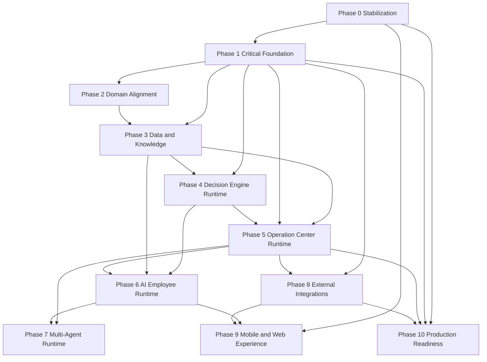

# SPP Implementation Roadmap — Version 1.0

> Official execution roadmap for Smart Property Platform (SPP) Implementation Phase.  
> Transforms `IMPLEMENTATION_GAP_REPORT.md` into ordered delivery under **frozen** Enterprise Architecture v1.0.  
> **This document plans only.** It does not modify production code, close gaps, or redesign architecture.

| Field | Value |
|---|---|
| Document status | Official Implementation Roadmap |
| Architecture version | SPP Enterprise Architecture **v1.0** (frozen) |
| Roadmap version | 1.0 |
| Gap source (sole) | [`IMPLEMENTATION_GAP_REPORT.md`](./IMPLEMENTATION_GAP_REPORT.md) |
| Freeze contract | `docs/ARCHITECTURE_FREEZE.md` (Architecture Phase closed — no structural invention without RFC) |
| SSOT index | [`docs/README.md`](./docs/README.md) |
| Precedence | Constitution → Domain Model → Blueprint → Supporting → Operating path ([`docs/ARCHITECTURE_GOVERNANCE.md`](./docs/ARCHITECTURE_GOVERNANCE.md) §2.2) |

---

## 0. Governing rules for this roadmap

1. **Architecture Freeze.** Boundaries, gate semantics, prepare-not-send, identity, Smart Import sheet/column freeze, and authority classes are frozen. Implementation fills Partial/Planned surfaces; it does **not** invent new architecture (`ARCHITECTURE_FREEZE` §§8, 12, 25).
2. **Gap source.** Every implementation work item below traces to an ID in `IMPLEMENTATION_GAP_REPORT.md`. No new gap IDs are invented here.
3. **Status honesty.** Blueprint status legends win over operating-path claims (Governance G-04). Where code exceeds Placeholder, Phase 1 conforms code to the freeze (or opens an RFC before elevating status).
4. **Rule 2 ordering.** Stability and trust before feature expansion: Critical gaps before domain completion; event bus before multi-agent; outbound rails only behind owner-enabled policy and Blueprint-compliant status.
5. **Protected subsystems.** No Smart Import mapping / Sheets rename work unless an explicitly scoped task later supersedes this roadmap. Executive Report capability must not be reduced.
6. **No production code in this document.** Modules listed are *targets*, not change instructions for this commit.

---

## Phase 0 — Project Stabilization

### Objective
Restore a buildable, releasable delivery train: valid frontend config, parsable client modules, working portal-bridge CI, and one honest release branch.

### Business value
Without a green build and a single release train, no later phase can ship safely to beta owners. Stabilization protects trust in OTA and portal links.

### Related Architecture Documents
- Blueprint §§4.1, 4.3, 16 (topology, release matrix, branch-split risk)
- System Architecture §18 (deployment)
- `docs/OTA_AUTO_UPDATE.md`, `docs/EXPO_BETA_TESTING.md` (operating path — defer to Blueprint on conflict)
- Architecture Freeze §§8, 25 (bug/stability allowed without RFC)

### Related Implementation Gaps
| Gap ID | Role in phase |
|---|---|
| GAP-C06 | Frontend parse/`app.json` breaks block build and OTA |
| GAP-C03 | Portal Pages workflow invalid YAML |
| GAP-C07 | Automations target missing `origin/master` |
| GAP-H01 | main/master split + dual OTA |
| GAP-M04 | Conflicting OTA docs |
| GAP-M07 | `deploy-smart-employee.yml` duplicate keys / second-product name |
| GAP-L01 | Stale MERGE_GATE_PLAN read as active plan |
| GAP-M08 | STITCH map path `SPP_Flutter/frontend` misleads |

### Files or Modules affected
- `frontend/src/api/client.ts`
- `frontend/src/components/ServiceActivationPanel.tsx`
- `frontend/app.json`
- `.github/workflows/portal-pages.yml`
- `.github/workflows/eas-ota-beta.yml`
- `.github/workflows/expo-ota-update.yml`
- `.github/workflows/benchmark-regression.yml`
- `.github/workflows/android-apk-eas.yml`
- `.github/workflows/deploy-smart-employee.yml`
- `render.yaml`
- `docs/OTA_AUTO_UPDATE.md`, `docs/EXPO_BETA_TESTING.md`
- `docs/MERGE_GATE_PLAN.md`, `docs/STITCH_SCREEN_MAP.md`

### Dependencies
- None (entry phase). May proceed under Freeze as stability work.

### Risks
- Unifying branches without updating Render may stall API deploys.
- Deleting the “wrong” OTA workflow mid-flight could skip a beta publish.
- Doc-only fixes without CI gates allow regressions.

### Success Criteria (Definition of Done)
- [ ] `frontend/app.json` parses as JSON; Expo updates block is valid.
- [ ] `client.ts` and `ServiceActivationPanel.tsx` typecheck/parse.
- [ ] `portal-pages.yml` is valid YAML and publishes HTML with `text/html`.
- [ ] Exactly one OTA workflow fires on the canonical branch for `frontend/**`.
- [ ] Benchmark + API deploy triggers target an **existing** remote branch.
- [ ] Operating OTA docs name that single workflow/branch.
- [ ] smart-employee deploy workflow name reflects experimental SPP surface (Option A).

### Estimated Complexity
**Medium**

---

## Phase 1 — Critical Foundation

### Objective
Enforce trust architecture: prepare-not-send, fail-closed webhooks in production, no provider secrets on device, and honest Green API / outbound status under the freeze.

### Business value
Owner trust is the product. A wrong automated message or leaked credential is unrecoverable. This phase makes the platform safe enough to keep implementing.

### Related Architecture Documents
- Constitution §§7, 11 (AI proposes; decisions require reason/evidence; human approval)
- Blueprint §§2.5, 8.2–8.4, 13.3, 15, 19
- System Architecture C-03, C-04, C-11; §§12–13
- Architecture Freeze §§8, 12, 27 (G-04 accepted open; Blueprint wins)

### Related Implementation Gaps
| Gap ID | Role in phase |
|---|---|
| GAP-C01 | Desk WhatsApp send bypasses approval record |
| GAP-C02 | Webhooks accept any request when secret unset |
| GAP-C05 | Provider secrets stored in `spp.connections` |
| GAP-C04 | Green API status conflict (Blueprint Placeholder vs Live code/APP_PATH) |
| GAP-L04 | APP_PATH status column (G-04) — documentation reconciliation only |

### Files or Modules affected
- `frontend/src/components/SmartEmployeeDesk.tsx`
- `frontend/src/utils/smart-employee-agent.ts`
- `frontend/src/utils/kowil-platform-dispatch.ts`
- `frontend/src/hooks/useOperational.ts`
- `frontend/src/api/client.ts`
- `frontend/src/components/ServiceSetupScreen.tsx`
- `frontend/src/hooks/useConnections.ts`
- `backend/server.py` (`/integrations/whatsapp/send`, webhook routes, approve routes)
- `backend/adapters/integrations/green_api.py`
- `backend/adapters/ejar_client.py`, `utilities_client.py`, `platform_inbox_client.py`
- `backend/adapters/decision_approvals.py`
- `docs/APP_PATH.md` (status column only — no pillar rewrite)

### Dependencies
- **Requires Phase 0** for a buildable client before shipping trust fixes via OTA.
- Under Freeze: conform outbound behavior to Blueprint Placeholder **or** open RFC before elevating rail status (do not silently redesign).

### Risks
- Owners who relied on one-tap Green send will see a stricter approve→prepare flow.
- Fail-closed webhooks may break misconfigured beta demos — gate with explicit beta/local exception.
- Rotating secrets previously stored on devices requires owner communication.

### Success Criteria (Definition of Done)
- [ ] No collection/escalation path sends via Green API or claims “sent” without a persisted approval with prepared content and distinguishable delivery state.
- [ ] `/integrations/whatsapp/send` cannot dispatch without approval binding (or remains dry-run/deep-link only per freeze).
- [ ] Production/non-beta: empty webhook secret → reject (fail closed); tests prove it.
- [ ] App setup screens store **intent only**; no provider tokens/secrets in AsyncStorage; copy does not claim device encryption of secrets.
- [ ] APP_PATH status column matches Blueprint §§3.2, 8.2 (G-04 closable).
- [ ] Blueprint status remains honest; any elevation of Green API beyond Placeholder has an approved RFC first.

### Estimated Complexity
**Critical**

---

## Phase 2 — Domain Alignment

### Objective
Incrementally align code structure and ubiquitous language with Clean Architecture and Domain Model — without rewriting the product or changing Smart Import identities.

### Business value
Shared language and clear layer boundaries reduce regression risk, speed reviews, and prevent money/eligibility rules from living in widgets.

### Related Architecture Documents
- Domain Model §§2–3, §5.2 Building, §9 modeling gaps
- Blueprint §5 (layers), §5.4 review rejects
- Architecture Governance §6 (Koil naming), §9
- System Architecture §§2–3, C-02
- Architecture Freeze §8 (incremental implementation within boundaries)

### Related Implementation Gaps
| Gap ID | Role in phase |
|---|---|
| GAP-H02 | Clean Architecture packages not realized |
| GAP-H07 | Engines/adapters read `os.environ` directly |
| GAP-M02 | Building entity still count-only |
| GAP-M03 | Domain Model §9 entity gaps (start Invoice/UtilityAccount/Maintenance registry slices) |
| GAP-M01 | Kowil→Koil rename (code/docs aliases; no visual brand redesign) |

### Files or Modules affected
- `frontend/src/types/`, `frontend/src/utils/`, `frontend/app/` (extract Domain/Application gradually)
- `backend/server.py` (thin routers over time)
- `backend/adapters/**` (config injection boundaries)
- `frontend/src/utils/kowil-*.ts`, i18n keys (alias-preserving rename)
- Property OS types and apply pipeline for Building identity

### Dependencies
- Phase 1 complete for trust invariants before large moves.
- Building / Invoice / UtilityAccount work must preserve Smart Import + Sheets freeze.
- Koil rename is mechanical; UI identity/tokens unchanged unless product explicitly requests later.

### Risks
- Large refactors without incremental PRs risk regressions (Rule 7: incremental only).
- Premature entity expansion that invents columns/sheets would violate freeze — reject in review.

### Success Criteria (Definition of Done)
- [ ] Documented layer map in repo matches Blueprint §5 for new code paths (Presentation does not compute arrears/occupancy eligibility).
- [ ] Configuration port exists; new engine code does not read env keys directly.
- [ ] Building has first-class identity attachable to units (or explicit accepted deferral with owner — prefer implement toward Domain Model).
- [ ] At least one Domain Model §9 entity advanced with tests and reporting continuity preserved.
- [ ] New normative strings use **Koil**; Kowil remains historical alias only.

### Estimated Complexity
**High**

---

## Phase 3 — Data & Knowledge Layer

### Objective
Make critical event streams durable, strengthen Knowledge Base longitudinal memory foundations, and keep Executive Report generation available when Sheets is absent.

### Business value
History that vanishes on restart cannot support Operations Center or learning. Durable knowledge and reports are how owners trust AI recommendations over time.

### Related Architecture Documents
- Blueprint §§10.3, 11, 14, 19
- Domain Model §§5.18 KnowledgeBase, 5.22 SmartEvent, §9
- System Architecture §§5–6, SA-08
- Engine Vision (Learning Layer direction — implement later in Phase 6; foundations here)
- Architecture Freeze §21 (gaps remain tracked; close toward owning specs)

### Related Implementation Gaps
| Gap ID | Role in phase |
|---|---|
| GAP-H05 | Platform inbox memory-only |
| GAP-H03 | Learning Layer not built (storage/foundation only in this phase) |
| GAP-M03 | KnowledgeBase longitudinal / related entity persistence |
| GAP-L02 | Soft device prefs → future client profile |
| GAP-M06 | No service-side PDF renderer |

### Files or Modules affected
- `backend/server.py` (`platform_events` / approvals persistence)
- Document-store adapters / Mongo collections
- `backend/adapters/portfolio_memory/`
- AI state retention keyed by analysis identity
- Report generation path (Sheets + future service fallback)
- Frontend prefs types (migration hooks only)

### Dependencies
- Phase 1 fail-closed and approval records (so persisted events are trustworthy).
- Phase 2 config boundaries preferred before new persistence adapters.
- Longitudinal memory **before** multi-agent Phase Four autonomy (Blueprint §11.4 / System Architecture §6.4).

### Risks
- Migrating memory-only streams without idempotent keys duplicates work.
- PDF fallback must not fork report truthfulness rules (engines own numbers).

### Success Criteria (Definition of Done)
- [ ] Platform inbox events/approvals survive process restart when Mongo configured; memory fallback only for beta/demo.
- [ ] Provenance edge (fact → asserting batch/event) preserved for new knowledge writes.
- [ ] Client-profile / preference memory schema sketched and storage path exists (full ranking use in Phase 6).
- [ ] Service-side report document fallback available when Sheets engine unset, without reducing report sections quality.
- [ ] Executive Report / Owner Dashboard capability not reduced.

### Estimated Complexity
**High**

---

## Phase 4 — Decision Engine Runtime

### Objective
Ensure one gated, evidence-bearing owner agenda in runtime: generation → unification → scoring → gate → proposal → approval → prepare (not silent execute), with learning signals ready to consume.

### Business value
Owners need one ranked agenda, not four engine opinions. Gated confidence prevents confidently wrong actions.

### Related Architecture Documents
- Constitution §11
- Blueprint §13 (pipeline + gate semantics)
- Domain Model §5.15 Decision
- System Architecture §9
- Freeze set Decision Engine supporting doc (when present under `docs/`)
- Architecture Freeze §6 ownership: Decision Engine **decides**

### Related Implementation Gaps
| Gap ID | Role in phase |
|---|---|
| GAP-C01 | Residual approval/delivery coupling (complete if any remain after Phase 1) |
| GAP-H03 | Wire approve/edit/dismiss/snooze into ranking inputs (consume Phase 3 storage) |
| GAP-L03 | Track SA decision-related production gaps without inventing autonomy |

### Files or Modules affected
- `backend/adapters/decisions/unifier.py`
- `backend/adapters/gate/`
- `backend/adapters/decision_approvals.py`
- `backend/adapters/lifecycle/`, `executive_intelligence/`
- Frontend pending approvals / desk task completion hooks
- Read models that must reapply gate (briefings, brain, verdicts)

### Dependencies
- Phase 1 prepare-not-send invariants.
- Phase 3 preference/decision memory storage for learning signals.
- Must not grant AI execution authority.

### Risks
- Changing scoring without golden/benchmark coverage regresses agenda quality.
- Softening gate to “go faster” is an architecture violation — reject.

### Success Criteria (Definition of Done)
- [ ] All four candidate sources still unify to one decision per real-world action.
- [ ] Blocked gate prevents execution; warning caps confidence visibly.
- [ ] Approval always persists actor, time, prepared content; delivery state starts unsent.
- [ ] Owner dismiss/edit/approve adjusts future ranking weights via stored signals.
- [ ] Benchmark + decision/gate contract tests green.

### Estimated Complexity
**High**

---

## Phase 5 — Operation Center Runtime

### Objective
Realize Operations Center as the shared intake path: unified event envelope behind existing surfaces, then store migration, then outbox — per Blueprint §12.4 order. No broker shortcut.

### Business value
External reality (Ejar, utilities, messaging) becomes coordinated work with auditability, not silent per-integration side channels.

### Related Architecture Documents
- Constitution §10
- Blueprint §§7, 12, 19; §17.5 prerequisites
- Domain Model §5.22 SmartEvent
- System Architecture §§10–11, SA-03, SA-04
- Architecture Freeze §6: Operation Center **coordinates**

### Related Implementation Gaps
| Gap ID | Role in phase |
|---|---|
| GAP-H04 | No event bus / worker / unified SmartEvent |
| GAP-H05 | Completed durability is prerequisite; OC consumes durable streams |
| GAP-L03 | SA-03/SA-04 tracking (envelope tracing, worker tier) |

### Files or Modules affected
- `backend/adapters/ejar_events.py`, `utilities_events.py`, `platform_inbox_events.py`
- `backend/server.py` webhook handlers
- Frontend `ejar-sync.ts`, `utilities-sync.ts`, `platform-inbox-sync.ts`
- Future shared envelope module + outbox store
- Worker process introduction (after single-process risk addressed)

### Dependencies
- Phase 3 durable streams.
- Phase 1 auth fail-closed.
- Phase 4 approval semantics unchanged when OC prepares pending actions.
- **Worker tier only after** envelope + outbox (Blueprint §12.4).
- Multi-agent Phase 7 blocked until this phase reaches envelope+outbox maturity.

### Risks
- Introducing a broker before envelope creates unpayable debt (Freeze + Blueprint reject).
- Dual dedupe (server + device) must remain correct during migration.

### Success Criteria (Definition of Done)
- [ ] Unified envelope exists behind existing integration read APIs (no breaking client contract).
- [ ] Per-integration stores moved onto envelope without vendor field leakage past normaliser.
- [ ] Outbox for prepared actions exists; retries do not duplicate approval.
- [ ] Traceability from intake → interpretation → approval → (future) dispatch.
- [ ] No scheduled/retry worker until single-process topology plan is explicit.

### Estimated Complexity
**Critical**

---

## Phase 6 — AI Property Employee Runtime

### Objective
Harden the owner-facing AI Employee (Koil): always-available desk, deterministic/AI/learning layer separation, controlled interpretation guardrails, and learning from owner judgement.

### Business value
The product centre of gravity is the Property Employee. Degraded mode must still advise; LLM must never invent money or claim execution.

### Related Architecture Documents
- Constitution §§3–7
- Blueprint §6
- Engine Vision (three layers)
- Domain Model §5.13 AIEmployee
- System Architecture §4
- Architecture Freeze §6: Employee **faces the owner**; never approves
- Governance §6 naming (Koil)

### Related Implementation Gaps
| Gap ID | Role in phase |
|---|---|
| GAP-H03 | Learning Layer runtime (client profile consumption) |
| GAP-L02 | Migrate soft prefs into client profile |
| GAP-M01 | Complete Koil naming in employee surfaces |
| GAP-C01 | Desk actions remain prepare-gated (regression guard) |

### Files or Modules affected
- `backend/adapters/ai_employee/`
- `backend/adapters/koil/`
- `backend/adapters/llm/`
- `frontend/src/components/SmartEmployeeDesk.tsx`
- `frontend/src/utils/kowil-local-brain.ts` → Koil aliases
- `frontend/src/utils/smart-employee-agent.ts`
- `frontend/app/brain.tsx`

### Dependencies
- Phases 1, 3, 4.
- Phase 5 enrichment from OC events preferred for “informed” mode but local OS fallback must work offline (Blueprint §6.4).

### Risks
- Enabling LLM without validator/fallback violates Engine Vision.
- Learning that becomes global rules = Rule Explosion — reject.

### Success Criteria (Definition of Done)
- [ ] Desk answers when API/LLM down (deterministic local path).
- [ ] LLM path (when enabled) passes no-invented-numbers/entities/decisions/execution guardrails.
- [ ] Learning stores per-client corrections; no new global rules per owner file shape.
- [ ] Employee never approves; every irreversible path has approval record.
- [ ] User-facing copy uses Koil / AI Employee / Smart Employee desk per Governance §6.

### Estimated Complexity
**High**

---

## Phase 7 — Multi-Agent Runtime

### Objective
Evolve from one generalist to specialist proposers under one coordinator, following Blueprint §17 rollout phases — only after OC event maturity.

### Business value
Specialists improve proposal quality (collection, leasing, maintenance, utilities, data quality, reporting) while the owner still sees **one agenda**.

### Related Architecture Documents
- Blueprint §17
- System Architecture §17
- Multi-Agent Architecture supporting doc (freeze set)
- Architecture Freeze §6 ownership map
- Constitution: AI never approves

### Related Implementation Gaps
| Gap ID | Role in phase |
|---|---|
| GAP-H04 | Prerequisite envelope/outbox/worker progression |
| GAP-L03 | SA multi-agent / cloud maturity items |
| GAP-H03 | Longitudinal memory prerequisite for Phase Four autonomy |

### Files or Modules affected
- Task generators behind AI Employee identity (Phase One specialisation)
- Coordinator merge layer
- Shared Knowledge Base read paths (no private truth copies)
- Observability of what each agent read/proposed

### Dependencies
| Multi-agent phase (Blueprint §17.5) | Prerequisite from this roadmap |
|---|---|
| One — internal specialisation | Phases 4–6 |
| Two — explicit specialist boundaries | Phase 5 unified envelope |
| Three — independent execution + retry | Phase 5 outbox + worker |
| Four — continuous autonomy in policy budgets | Dispatch rails (Phase 8) + longitudinal memory (Phase 3/6) + accuracy tracking |

### Risks
- Advertising autonomy before rails/memory = Freeze/Blueprint violation.
- Specialists that bypass the gate or invent a second agenda — reject.

### Success Criteria (Definition of Done)
- [ ] Phase One: distinct generators, one employee identity, one agenda.
- [ ] Phase Two+: coordinator merges overlaps; conflicts escalate to owner.
- [ ] Gate applies to every specialist equally.
- [ ] Approval remains singular and human.
- [ ] No private per-agent truth stores.

### Estimated Complexity
**Critical** (organizational + runtime)

---

## Phase 8 — External Integrations

### Objective
Complete anti-corruption integrations to Blueprint-honest status: HA/sensors registry, lease/utility depth, and outbound rails only via RFC + owner-enabled policy.

### Business value
External events become operational work; messaging/payments remain trustworthy because dispatch is explicit and approved.

### Related Architecture Documents
- Blueprint §§3.2, 8, 19
- Domain Model §§5.19–5.21, §9
- System Architecture §12
- APP_PATH (status must track Blueprint)
- Architecture Freeze §27 (G-04); RFC required to change prepare-not-send or add rails

### Related Implementation Gaps
| Gap ID | Role in phase |
|---|---|
| GAP-H06 | HA/sensors beyond demo — registry, thresholds, staleness |
| GAP-C04 | Outbound rail status — only after RFC if elevating beyond Placeholder |
| GAP-M03 | LeasePlatform bidirectional; UtilityAccount standing entity |
| GAP-L04 | Close G-04 after statuses reconciled |
| GAP-L03 | Payment/maps rails remain Absent until owner-enabled design |

### Files or Modules affected
- `backend/adapters/integrations/home_assistant.py`, `green_api.py`, `status.py`
- Ejar / utilities / platform inbox adapters
- Frontend setup screens (intent + verification endpoints — **no secrets**)
- `frontend/app/sensors.tsx`
- Sensor/device registry models

### Dependencies
- Phase 1 credential boundary and prepare-not-send.
- Phase 5 envelope for new consumers.
- **RFC before** any normative elevation of Green API / payment dispatch in Blueprint.

### Risks
- Re-introducing secrets into the app (regression of C05).
- Treating local “connected” wizard steps as proof of connectivity.

### Success Criteria (Definition of Done)
- [ ] Each integration exposes healthy/degraded/disconnected via server status.
- [ ] HA: device registry + thresholds + stale handling; demo data labeled when not live.
- [ ] Vendor fields stop at normaliser; bilingual summaries at normalisation time.
- [ ] Outbound dispatch (if enabled) uses outbox + approval; delivery ≠ preparation.
- [ ] APP_PATH and Blueprint status tables agree; G-04 closed.

### Estimated Complexity
**High**

---

## Phase 9 — Mobile & Web Experience

### Objective
Polish Presentation adapters (Expo owner app, portals, experimental Arabic surface) without identity redesign — functions and clarity only.

### Business value
Owners and portal actors get a coherent workplace for the AI Employee and operations, including OTA-stable beta installs.

### Related Architecture Documents
- Blueprint §§3.1, 4.1–4.2, 16.2
- System Architecture §2
- Governance §6.3 Option A (`smart-employee/`)
- `docs/STITCH_SCREEN_MAP.md`, `docs/EXPO_BETA_TESTING.md`
- Architecture Freeze: no Constitution-level identity shift without RFC

### Related Implementation Gaps
| Gap ID | Role in phase |
|---|---|
| GAP-M01 | Finish Koil naming in UI copy |
| GAP-M08 | Correct STITCH paths to `frontend/` |
| GAP-M07 | Experimental surface deploy naming (if residual) |
| GAP-C06 / Phase 0 | OTA path remains green |
| GAP-H02 | Presentation must not re-absorb domain rules |

### Files or Modules affected
- `frontend/app/**`, `frontend/src/components/**`
- Portal routes and `docs/portal-open.html`
- `smart-employee/**` (Presentation experiment only)
- OTA utilities / `eas.json` / channel `beta`

### Dependencies
- Phases 0–1 for safe OTA of trust fixes.
- Domain/OC/Employee runtimes (2–6) for screens to bind to real data.
- **No** visual identity redesign; **no** second product constitution.

### Risks
- UX “improvements” that fork branding or invent parallel domain language.
- OTA runtimeVersion mismatch after native bumps.

### Success Criteria (Definition of Done)
- [ ] Owner desk, portals, and reports bind to gated/engine truths (not widget-computed money).
- [ ] `smart-employee/` remains experimental Arabic SPP surface under one Constitution.
- [ ] STITCH map and operating docs point at `frontend/`.
- [ ] Beta OTA on channel `beta` succeeds from the canonical branch.
- [ ] Identity tokens/navigation philosophy unchanged unless explicit product request + RFC if constitutive.

### Estimated Complexity
**Medium**

---

## Phase 10 — Production Readiness

### Objective
Meet enterprise operability: observability, SLO/error budgets, DR drills, durable production streams, and release/rollback discipline.

### Business value
Production claims become defensible. Incidents are reconstructable. Approvals and apply history are backed up.

### Related Architecture Documents
- System Architecture §§14–20, §23 (SA-01…SA-08)
- Blueprint §§4.3, 15, 16, 19
- Architecture Freeze §§26–29 (compliance verification)

### Related Implementation Gaps
| Gap ID | Role in phase |
|---|---|
| GAP-M05 | Observability / SLO / DR incomplete |
| GAP-L03 | Remaining SA enterprise gaps |
| GAP-C02 | Production fail-closed verified in real env |
| GAP-H05 | No memory-only **production** critical streams |
| GAP-H01 / C07 | Release train permanently unified |

### Files or Modules affected
- API health/metrics/logging middleware
- Backup/restore runbooks (docs + automation)
- CI quality gates (benchmark levels, lint, tsc, yaml/json validate)
- Render/hosting config for multi-instance readiness
- Secret manager / env separation (beta vs production)

### Dependencies
- Phases 0–1 mandatory; Phase 5 envelope tracing strongly preferred for SA-03.
- Worker tier (Phase 5) before queue-depth SLOs.

### Risks
- Marketing SLA before DR drills.
- Multi-region without outbox idempotency → double dispatch.

### Success Criteria (Definition of Done)
- [ ] Correlation IDs for analysis/decision/approval/event across logs.
- [ ] Gate block/warning rates and LLM fallback rate measurable.
- [ ] Backup includes approvals, applied analysis, operation/event stores; restore drill recorded.
- [ ] Production: fail-closed secrets; no memory-only critical streams.
- [ ] Numeric RPO/RTO targets documented before SLA marketing.
- [ ] Freeze compliance checklist used on structural PRs (RFC or reject).

### Estimated Complexity
**High**

---

## Overall dependency graph



**Hard edges (architecture-mandated):**
- Event envelope/outbox **before** multi-agent Phase Two+ / worker consumers.
- Longitudinal memory + learning foundations **before** autonomous multi-agent Phase Four.
- Prepare-not-send + no device secrets **before** enabling any outbound rail.
- RFC **before** changing Blueprint Placeholder→Implemented for messaging/payment rails.

---

## Critical path

```
Phase 0 → Phase 1 → Phase 3 → Phase 5 → Phase 7
                ↘ Phase 4 → Phase 6 ↗
```

Parallelizable after Phase 1: Domain Alignment (2) alongside Data/Knowledge (3).  
Phase 8 integrations deepen after Phase 5 envelope.  
Phase 9 UX tracks continuously but ships trust fixes first.  
Phase 10 gates production marketing claims.

---

## Recommended implementation order

| Order | Phase | Rationale |
|---|---|---|
| 1 | Phase 0 | Cannot ship without build/CI |
| 2 | Phase 1 | Trust architecture is non-negotiable |
| 3 | Phase 3 (durability slice) + Phase 2 (incremental) | Persist truth; start layering |
| 4 | Phase 4 | Agenda integrity on durable data |
| 5 | Phase 5 | OC envelope → outbox → worker |
| 6 | Phase 6 | Employee learning + guardrails on real OC feeds |
| 7 | Phase 8 | Integrations to honest Partial/Implemented |
| 8 | Phase 7 | Multi-agent only when prerequisites met |
| 9 | Phase 9 | Experience polish on stable runtime |
| 10 | Phase 10 | Production operability and SLOs |

Within each phase, close **Critical** gap IDs before **High**, then **Medium**, then **Low**.

---

## Milestones

| Milestone | Exit evidence | Maps to |
|---|---|---|
| **M0 — Train green** | Valid workflows; one OTA path; portal HTML live | Phase 0 |
| **M1 — Trust floor** | Prepare-not-send + fail-closed + no device secrets + status honesty | Phase 1 |
| **M2 — Domain spine** | Layers/config ports; Building (or accepted plan); Koil naming underway | Phase 2 |
| **M3 — Durable knowledge** | Platform events durable; KB provenance; report fallback | Phase 3 |
| **M4 — One agenda** | Unified gated decisions + learning signals consumed | Phase 4 |
| **M5 — OC envelope** | Unified envelope + outbox; traces | Phase 5 |
| **M6 — Employee maturity** | Offline desk; LLM guardrails; client learning | Phase 6 |
| **M7 — Integration honesty** | HA registry; G-04 closed; rails only via policy/RFC | Phase 8 |
| **M8 — Digital workforce** | Specialists under coordinator per §17 phase gates | Phase 7 |
| **M9 — Experience freeze-compatible** | Portals + OTA + Option A surface | Phase 9 |
| **M10 — Production ready** | SLO/DR/observability; compliance checklist live | Phase 10 |

---

## Acceptance Gates

| Gate | Blocks | Criteria |
|---|---|---|
| **G-Stab** | Any OTA/APK | Phase 0 DoD; lint/tsc/json/yaml CI |
| **G-Trust** | Any outbound or “Live integration” claim | Phase 1 DoD; security review of secrets + webhooks |
| **G-Import** | Import/engine PRs | Smart Import compatibility; benchmark L1+L3; no sheet/column renames |
| **G-Gate** | Decision/employee release | Consistency gate contract tests; blocked ⇒ no execute |
| **G-OC** | Multi-agent Phase Two+ | Envelope + outbox present; no broker-only shortcut |
| **G-Freeze** | Structural PRs | RFC approved **or** change is non-structural; Architecture Freeze checklist |
| **G-Report** | Reporting changes | Executive Report sections preserved; numbers from engines |
| **G-Prod** | Production SLA marketing | Phase 10 DoD; restore drill evidence |

---

## Release strategy

| Track | Mechanism | Branch policy | Notes |
|---|---|---|---|
| Frontend JS | Expo OTA channel `beta` | Canonical branch only (Phase 0 unification) | No APK for JS-only |
| Native APK | EAS / GitHub Release `spp-beta.apk` | Manual when native/runtimeVersion changes | |
| API | Managed cloud (Render) | Same canonical branch as CI | Fail-closed secrets in production class |
| Portal bridge | GitHub Pages from `docs/portal-open.html` | Docs path on canonical branch | Verify `text/html` |
| Sheets engine | Independent Apps Script deploy | Owner-operated | Dual-import contract parity via benchmarks |
| Experimental Arabic surface | Separate Presentation deploy | Must not fork engines/domain | Option A |

**Versioning:** OTA `runtimeVersion` tracks app version. API remains backward compatible with installed clients. Blueprint status legends govern release notes language (Implemented / Partial / Placeholder / Planned).

---

## Rollback strategy

| Failure class | Rollback action |
|---|---|
| Bad OTA JS | Republish previous Expo update on `beta`; keep APK unchanged |
| Bad native APK | Point latest release asset to last known good APK; block OTA if runtime mismatch |
| Bad API deploy | Redeploy previous Render/API revision; clients continue on device Property OS |
| Bad apply/import | Change log + official-record precedence; compensating import; never silent history rewrite |
| Bad integration rail | Mark rail disconnected; stop dispatch; approvals remain prepared/unsent |
| Config/secret incident | Rotate secrets server-side; wipe device-stored secrets if any residual (Phase 1 must eliminate) |

**Rule:** Rollback must not require wiping owner-confirmed official records (Blueprint §2.9 / device-first principle).

---

## Testing strategy

| Layer | Scope | When |
|---|---|---|
| Unit / contract | Gate normalizer, decision unifier, approval prepare, webhook auth fail-closed | Every Phase 1–5 PR |
| Backend suite | `pytest` offline set (exclude live-only tests per AGENTS notes) | Continuous on backend paths |
| Benchmarks | L1 synthetic + L3 variants always; L2 golden when files present | Engine / import changes |
| Frontend | `yarn lint` + tsc; JSON validate `app.json` | Frontend / OTA PRs |
| Workflow | YAML parse all `.github/workflows/*` | Phase 0 and CI changes |
| Integration | Status endpoints degrade when env unset; no secrets in app bundles | Phase 1 / 8 |
| Proof artifacts | Per work package evidence under `proofs/` (operational, not law) | Each milestone |
| DR drill | Restore approvals + ai_state + events | Phase 10 |
| Freeze compliance | PR checklist: boundaries / RFC / Smart Import / reporting | Every structural PR |

**Forbidden “tests”:** Benchmarks that hardcode one owner’s file shape into engine logic (Engine Vision reject).

---

## Deployment strategy

1. **Environment classes** (System Architecture §18.2): Local/cloud-agent (beta mode) → Beta (OTA) → Production (fail-closed, durable store).
2. **Promote only through Acceptance Gates** above; never skip G-Trust for messaging claims.
3. **Dual import engines** stay in contract parity; GAS preferred when configured; local fallback otherwise.
4. **Single-process API** remains until Phase 5 explicitly introduces worker tier after envelope/outbox.
5. **Secrets** only in service environment / platform secret store — never in app binary or device JSON.
6. **Documentation:** Update gap status in `IMPLEMENTATION_GAP_REPORT.md` (or promoted docs gap registry) when a gap closes; do not fork Blueprint §19.
7. **RFC path:** Any change to frozen normative meaning pauses implementation until RFC approval (`ARCHITECTURE_FREEZE` §9).

---

## Gap coverage matrix

| Gap ID | Primary phase | Secondary |
|---|---|---|
| C01 | 1 | 4, 6 |
| C02 | 1 | 10 |
| C03 | 0 | — |
| C04 | 1 | 8 (RFC if elevating) |
| C05 | 1 | 8 |
| C06 | 0 | 9 |
| C07 | 0 | 10 |
| H01 | 0 | 10 |
| H02 | 2 | 9 |
| H03 | 3 | 4, 6 |
| H04 | 5 | 7 |
| H05 | 3 | 5 |
| H06 | 8 | — |
| H07 | 2 | — |
| M01 | 2 | 6, 9 |
| M02 | 2 | — |
| M03 | 2 | 3, 8 |
| M04 | 0 | — |
| M05 | 10 | — |
| M06 | 3 | — |
| M07 | 0 | 9 |
| M08 | 0 | 9 |
| L01 | 0 | — |
| L02 | 3 | 6 |
| L03 | 5, 7, 10 | — |
| L04 | 1 | 8 |

**Coverage rule:** Every ID from `IMPLEMENTATION_GAP_REPORT.md` appears above. Closing a gap means meeting the owning phase DoD and updating the gap registry — not deleting history.

---

## Out of scope for this roadmap

- Redesigning SPP identity, brand tokens, or navigation philosophy.
- Smart Import column/sheet renames or mapping changes.
- Architecture document rewrites (use RFC).
- Treating `HANDOFF.md` / chat as law.
- Implementing production code in the same change set as this planning document.

---

## Document status

*Document Status:* Official Implementation Roadmap for SPP Version 1.0  

*Version:* 1.0  

*Class:* Implementation planning (execution law for delivery ordering; subordinate to frozen architecture)  

*Gap source:* [`IMPLEMENTATION_GAP_REPORT.md`](./IMPLEMENTATION_GAP_REPORT.md)  

*Architecture contract:* `docs/ARCHITECTURE_FREEZE.md` + freeze set under `docs/`  

*Change policy:* Reordering phases that break Freeze/Blueprint prerequisites requires architecture owner approval. Adding work that invents boundaries requires RFC before the roadmap may list it as implementable.
