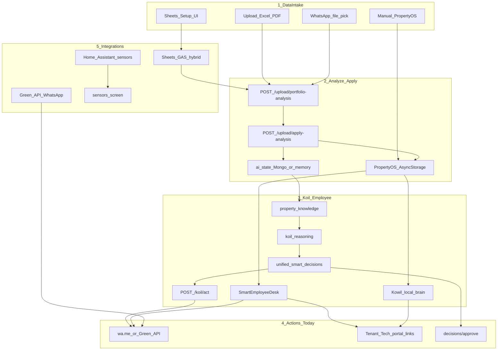

# SPP Application Path — Intake → Integrations

> Single operating reference for the end-to-end path (phases A→D).
> Do not redesign UI identity. Do not change Smart Import column/sheet mapping unless explicitly tasked.

## Overview

| Phase | Name | Status |
|-------|------|--------|
| A | Data intake (manual / upload / WhatsApp pick / Sheets UI) | Live |
| B | Analyze → Apply → Koil / Smart Employee / Kowil brain | Live after Apply |
| C | Actions (wa.me / Green API, portals, decision approve) | Live (Green when env set; else wa.me) |
| D | Integrations (Sheets / Green API / Home Assistant / sensors) | Live via `/api/integrations/*` + env keys |

## Flow



## Key files

### A — Intake
- Manual: `frontend/app/setup/property-os.tsx`
- Upload: `frontend/app/upload.tsx` → `frontend/src/api/portfolio-analysis.ts`
- Apply to device: `frontend/src/utils/apply-analysis-to-os.ts`
- Backend: `backend/server.py` (`/upload/portfolio-analysis`, `/upload/apply-analysis`)

### B — Intelligence
- Koil engines: `backend/adapters/koil/`
- Act: `POST /api/koil/act`
- Smart employee: `frontend/src/utils/smart-employee-agent.ts`
- Kowil chat: `frontend/src/utils/kowil-local-brain.ts`

### C — Actions
- Portals: `frontend/src/utils/portal-links.ts`
- Approve: `POST /api/decisions/approve`
- WhatsApp send: Green API when configured, else `wa.me` deep link

### D — Integrations API
- Status: `GET /api/integrations/status`
- Sheets probe: `GET /api/integrations/sheets/status`
- WhatsApp send: `POST /api/integrations/whatsapp/send`
- Home Assistant: `GET /api/integrations/home-assistant/status`, sensors via `/api/sensors` when HA configured

## Processing order (stability first)

1. Data spine: import → analyze → Apply → phone/contract/ledger visible in Property OS + Kowil
2. Koil / employee gaps from real data + `/koil/act`
3. Sheets/GAS live status (no sheet/column renames)
4. Green API send with `wa.me` fallback
5. Home Assistant → `/api/sensors`

## Env keys (integrations)

```
GOOGLE_APPS_SCRIPT_URL=
SPP_API_KEY=
GREEN_API_INSTANCE_ID=
GREEN_API_TOKEN=
GREEN_API_API_URL=https://api.green-api.com
HOME_ASSISTANT_URL=
HOME_ASSISTANT_TOKEN=
```

## Constraints

- No UI identity redesign
- No Smart Import mapping changes unless explicitly requested
- Preserve API response shapes consumed by the frozen frontend
- Every integration: config from `.env`, graceful degrade when keys missing
