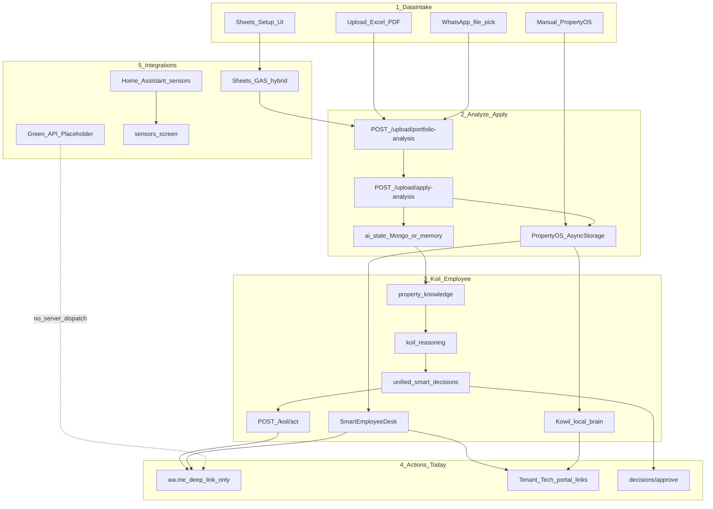

# SPP Application Path — Intake → Integrations

> Operating-path reference for the end-to-end path (phases A→D). **Not a pillar.**
> Status claims defer to `docs/SPP_BLUEPRINT.md`. Identity defers to `docs/SPP_CONSTITUTION.md`.
> Index: `docs/README.md`. Naming: `docs/ARCHITECTURE_GOVERNANCE.md` §6 (AI Employee / Koil).
> Do not redesign UI identity. Do not change Smart Import column/sheet mapping unless explicitly tasked.
>
> **Status honesty (G-04):** The **Blueprint status** column below is authoritative.
> Operating labels describe what the path *touches*; they must not outrank Blueprint §§3.2 / 8.2.

## Overview

| Phase | Name | Operating note | Blueprint status (authoritative) |
|-------|------|----------------|----------------------------------|
| A | Data intake (manual / upload / WhatsApp pick / Sheets UI) | Device + upload paths in use | Implemented (intake surfaces) |
| B | Analyze → Apply → Koil / Smart Employee / Kowil brain | Live after Apply | Implemented (core spine) / Partial (learning) |
| C | Actions (wa.me deep links, portals, decision approve) | Prepare-not-send; deep links only | Partial (approve + prepare); Green outbound **Placeholder** |
| D | Integrations (Sheets / Green API / Home Assistant / sensors) | Env-keyed server status + webhooks | See integration table below |

## Integration status vs Blueprint §§3.2 / 8.2

| Integration | Direction | Operating surface | Blueprint status (authoritative) |
|-------------|-----------|-------------------|----------------------------------|
| Google Sheets / GAS | Import / reports | `/api/integrations/sheets/status`, GAS hybrid | Partial / Implemented when GAS configured |
| Lease registry (Ejar) | Inbound webhooks | `/api/webhooks/ejar`, approve prepare-only | **Partial: inbound only** |
| Electricity provider | Inbound webhooks | `/api/webhooks/utilities/electricity` | **Partial: inbound only** |
| Water provider | Inbound webhooks | `/api/webhooks/utilities/water` | **Partial: inbound only** |
| Messaging channel | Inbound webhooks | Platform inbox | **Partial: memory-only persistence** |
| Intelligence channel | Inbound webhooks | Platform inbox | **Partial** |
| Home Assistant | Planned inbound | Setup intent + `/api/sensors` when env set | **Placeholder: setup screen / demo-capable** |
| Green API / WhatsApp | Planned outbound | Setup intent + `/api/integrations/whatsapp/send` | **Placeholder: client deep links only, no server sending** |
| Payment rails | Planned outbound | Approve prepares instructions | **Absent** |

## Flow



## Key files

### A — Intake
- Manual: `frontend/app/setup/property-os.tsx`
- Upload: `frontend/app/upload.tsx` → `frontend/src/api/portfolio-analysis.ts`
- Apply to device: `frontend/src/utils/apply-analysis-to-os.ts`
- Backend: `backend/server.py` (`/upload/portfolio-analysis`, `/upload/apply-analysis`)

### B — Intelligence
- Koil engines: `backend/adapters/koil/`
- Act: `POST /api/koil/act`
- Smart employee: `frontend/src/utils/smart-employee-agent.ts`
- Kowil chat: `frontend/src/utils/kowil-local-brain.ts`

### C — Actions
- Portals: `frontend/src/utils/portal-links.ts`
- Approve: `POST /api/decisions/approve` (prepare; `delivery_status` starts unsent)
- WhatsApp: **deep link / prepare only** — `POST /api/integrations/whatsapp/send` does not server-dispatch (Blueprint Placeholder)

### D — Integrations API
- Status: `GET /api/integrations/status`
- Sheets probe: `GET /api/integrations/sheets/status`
- WhatsApp prepare: `POST /api/integrations/whatsapp/send` (deep link; optional `approval_id`)
- Home Assistant: `GET /api/integrations/home-assistant/status`, sensors via `/api/sensors` when HA configured
- Credentials: **service environment only** — app setup screens store connection intent, never provider secrets

## Processing order (stability first)

1. Data spine: import → analyze → Apply → phone/contract/ledger visible in Property OS + Kowil
2. Koil / employee gaps from real data + `/koil/act`
3. Sheets/GAS live status (no sheet/column renames)
4. WhatsApp prepare → wa.me deep link (Green server send remains Placeholder until RFC)
5. Home Assistant → `/api/sensors` when configured (demo labeled when not live)

## Env keys (integrations — server / service environment only)

```
GOOGLE_APPS_SCRIPT_URL=
SPP_API_KEY=
GREEN_API_INSTANCE_ID=
GREEN_API_TOKEN=
GREEN_API_API_URL=https://api.green-api.com
HOME_ASSISTANT_URL=
HOME_ASSISTANT_TOKEN=
EJAR_WEBHOOK_SECRET=
ELECTRICITY_WEBHOOK_SECRET=
WATER_WEBHOOK_SECRET=
PLATFORM_WEBHOOK_SECRET=
```

## Constraints

- No UI identity redesign
- No Smart Import mapping changes unless explicitly requested
- Preserve API response shapes consumed by the frozen frontend
- Every integration: config from service `.env`, graceful degrade when keys missing
- Prepare-not-send: approval ≠ delivery; Green outbound stays Placeholder without RFC
- Webhooks fail closed in production/non-beta when secret unset
