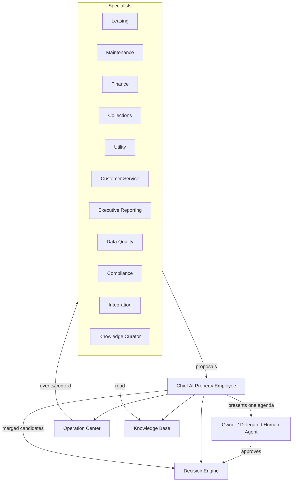

# SPP Multi-Agent Architecture v1.0

> Official Multi-Agent Enterprise Architecture specification for the Smart Property Platform (SPP).
> This is a core enterprise architecture document. It defines how specialized Digital Employees cooperate as one enterprise workforce under a single Chief AI Property Employee — not an LLM orchestration cookbook and not implementation code.
> Document process and SSOT rules: `docs/ARCHITECTURE_GOVERNANCE.md`. Index: `docs/README.md`.

---

# 0. Document authority and boundaries

## 0.1 Role in the document set

| Document | Owns | This document must |
|---|---|---|
| `docs/SPP_CONSTITUTION.md` | Product identity; AI proposes / humans approve | Obey; never fork product law per agent |
| `docs/DOMAIN_MODEL.md` | Ubiquitous language and entities | Shared language only; no per-agent domain forks |
| `docs/SPP_BLUEPRINT.md` | Multi-agent phases, coordination rules, delegation protocol fields | Link; not copy phase tables as the only truth |
| `docs/SYSTEM_ARCHITECTURE.md` | Topology prerequisites for agent consumers | Align rollout coupling |
| `docs/DATA_ARCHITECTURE.md` | Shared stores, retention, privacy | Align; no private agent ledgers |
| `docs/KNOWLEDGE_BASE.md` | Shared institutional memory | All agents read the same KB |
| `docs/DECISION_ENGINE.md` | Authority classes, unification, gate | Agents propose into one Decision agenda |
| `docs/OPERATION_CENTER.md` | Real-time coordination and intake | Agents are not alternate intake doors |
| `docs/AI_PROPERTY_EMPLOYEE.md` | Chief digital employee identity and ethics | Chief remains owner-facing identity |
| `docs/MULTI_AGENT_ARCHITECTURE.md` (this document) | Enterprise AI organization, hierarchy, registry, collaboration, governance of agents | Be the organizational architecture for every AI agent in SPP |

**Conflict rule:** Precedence follows Architecture Governance §2.2. This document deepens Blueprint §17, System Architecture §17, and AI Property Employee §26. It may not weaken prepare-not-send, gate semantics, Decision Engine authority classes, Knowledge Base shared-memory rules, or Constitution identity.

## 0.2 Foundational claim

| Claim | Statement |
|---|---|
| SPP is not a single-model product | SPP is an **Enterprise AI Organization** of specialized Digital Employees |
| Unity | Specialists work under one **Chief AI Property Employee** |
| Owner experience | The owner never negotiates with a committee of agents |
| Authority | Multi-agent increases **proposal quality**, never **execution authority** |

**Decision:** Multi-agent is an organizational architecture, not a swarm of autonomous bots. **Rationale:** Constitution §§3–5, §11; Blueprint §17.4. **Consequence:** Features that expose multiple competing owner agendas are rejected.

## 0.3 Status legend

Aligned with Blueprint: **Implemented** · **Partial** · **Placeholder** · **Planned**.

Current platform reality: one generalist AI Employee (**Partial** toward Phase One internal specialisation). Explicit specialist boundaries and independent agent execution remain **Planned** per Blueprint §17.5.

## 0.4 Decision record format

Every architectural choice below states **Decision**, **Rationale**, and **Consequence**. Gaps are first-class in §37 as **MA-***.

---

# 1. Vision

Evolve SPP from a single generalist intelligence into an **enterprise digital workforce**: specialized agents that understand leasing, maintenance, finance, collections, utilities, service, reporting, data quality, compliance, integrations, and knowledge curation — coordinated by one Chief AI Property Employee so the owner experiences one Property Employee, not twelve chatbots.

---

# 2. Mission

Organize AI labour the way a professional property firm organizes human labour:

1. Specialize for depth and quality of proposals.  
2. Coordinate for a single ranked agenda.  
3. Share one Knowledge Base and one Decision Engine.  
4. Keep humans as the sole approvers of consequential action.  
5. Remain observable, auditable, and governable at enterprise scale.

**Decision:** Mission success is better Property Operations, not more agents for their own sake. **Rationale:** Constitution Golden Principle. **Consequence:** New agents require a clear operational gap (see §34–§36), not novelty.

---

# 3. Multi-Agent Philosophy

| Decision | Rationale | Consequence |
|---|---|---|
| One Chief, many specialists | Owner cognitive load; Blueprint §17.2 | Single agenda face |
| Shared memory, private reasoning | Knowledge Base / Blueprint §17.4 | No private truth forks |
| Conflicts escalate, they do not vote | Trust and explainability | Trade-offs shown to owner/Chief |
| Gate is universal | Data integrity | No specialist bypass |
| Approval remains human and singular | Constitution §11 | Autonomy ≠ authority |
| Every agent is observable | Audit and learning | Reconstruct what was read/proposed |
| Domain language is shared | Domain Model SSOT | No per-agent vocabulary forks |
| Intake remains Operation Center | Constitution §10 | Agents are not webhook endpoints |

---

# 4. Organizational Structure

| Layer | Role |
|---|---|
| Human authority | Owner and delegated property managers |
| Chief AI Property Employee | Coordinator, owner relationship, single agenda |
| Specialist Digital Employees | Domain proposals and analyses |
| Platform engines | Decision Engine, Operation Center, Knowledge Base, Smart Import |

---

# 5. Chief AI Property Employee

The Chief is the AI Property Employee defined in `docs/AI_PROPERTY_EMPLOYEE.md`, elevated organizationally as **coordinator of the digital workforce**.

| Chief duty | Statement |
|---|---|
| Own owner relationship | One face, one desk, one agenda |
| Receive specialist proposals | Via versioned collaboration protocol |
| Resolve overlaps | One proposer per subject per cycle |
| Enforce ranking + gate | Via Decision Engine contracts |
| Escalate conflicts | Present trade-offs; do not silent-vote |
| Refuse forbidden paths | Even if a specialist suggests them |
| Preserve ethics/security | AI Property Employee §§33–34 apply to all specialists |

**Decision:** Specialists never become alternate owner-facing brands. **Rationale:** Identity protection; Governance naming. **Consequence:** UI may show specialist “lanes” only as explanation metadata under the Chief.

---

# 6. Agent Governance

| Governance rule | Effect |
|---|---|
| Registration required | No shadow agents outside the registry (§10) |
| Capability charter | Each agent has declared owns / must-not |
| Permission envelope | Tied to Decision authority + audience scope |
| Shared contracts | Decision, OC, KB collaboration mandatory |
| Change control | New agent or charter change revises this document |
| Phase gates | Blueprint §17.5 prerequisites before advanced autonomy |
| Constitution supremacy | No agent may redefine SPP identity |

---

# 7. Agent Hierarchy

| Rank | Agents | Authority |
|---|---|---|
| L0 Human | Owner, delegated property manager | Approve / override |
| L1 Chief | Chief AI Property Employee | Coordinate, present, refuse, escalate |
| L2 Domain specialists | Leasing, Maintenance, Finance, Collections, Utility, Customer Service, Executive Reporting, Data Quality, Compliance, Integration, Knowledge Curator | Propose within charter |
| L3 Transient task workers (future) | Short-lived helpers under a specialist | No owner face; no approval rights |

**Decision:** Hierarchy is coordination hierarchy, not social status that grants execution. **Rationale:** Approval singularity. **Consequence:** Higher rank cannot self-approve outbound money/messaging.

---

# 8. Agent Responsibilities

## 8.1 Initial official agent organization

| Agent | Owns (responsibility) | Must not | Primary inputs | Typical proposals | Status |
|---|---|---|---|---|---|
| **Chief AI Property Employee** | Owner relationship; single agenda; conflict escalation; ethics enforcement | Private domain monopoly; silent execution | All specialist outputs; KB; OC; Decision agenda | Merged ranked work; trade-off presentations | Partial (generalist today) |
| **Leasing Agent** | Occupancy, renewals, vacancy, transfers | Overwriting official lease records blindly | Contracts, expiry, vacancy duration, Ejar events | Renewal pricing, vacancy actions, transfer handling | Planned |
| **Maintenance Agent** | Asset condition, repair economics, assignments | Portfolio finance exposure to field | Tickets, asset memory, sensors | Preventive work, replace-vs-repair, tech assignment | Planned |
| **Finance Agent** | Ledger health, invoices, payment confirmation posture, financial impact framing | Inventing totals; collection harassment policy alone | Ledger, invoices, payment proofs | Finance review items; impact summaries; confirm-payment pendings | Planned |
| **Collections Agent** | Arrears recovery sequences and escalation posture | Acting on blocked/poor ledger quality | Ledger, reliability history, payment events | Reminder sequences, settlement plans, escalations | Planned |
| **Utility Agent** | Metered services, recharges, anomalies | Marking paid without rail/evidence | Utility events, meters, responsibility matrix | Pay preparation, responsibility transfer, anomaly follow-up | Planned |
| **Customer Service Agent** | Tenant/owner service interactions tone and routing of requests | Cross-audience data leaks; becoming unconstrained tenant advocate | Portal messages, tickets, notices | Service replies (prepared), routing to domain agents | Planned |
| **Executive Reporting Agent** | Owner communication narratives and report assembly guidance | Inventing report numbers | KB, decision memory, gate | Report/brief structure, top-decision commentary | Planned |
| **Data Quality Agent** | Trustworthiness of portfolio record | Silent official overwrites | Gate conflicts, change logs, gaps | Corrections to request, re-import, gap fill | Planned |
| **Compliance Agent** | Policy/regulatory posture, audience legality, retention/privacy warnings | Replacing legal counsel; silent policy mutation | Permissions, privacy classes, lease/utility constraints | Compliance review decisions; hold recommendations | Planned |
| **Integration Agent** | Rail health interpretation, ACL correctness signals, connection readiness | Holding secrets; bypassing OC intake | Rail status, auth failures, adapter health | Reconnect/verify actions; quarantine suggestions | Planned |
| **Knowledge Curator Agent** | Provenance hygiene, taxonomy promotion, snapshot coherence, editorial freshness | Hand-authoring free-text facts as truth | KB quality, superseded snapshots, editorial | Curation tasks; promotion/review items | Planned |

Blueprint §17.1 specialists map into this org (Collection ≈ Collections; Reporting ≈ Executive Reporting; Utilities ≈ Utility). Finance, Customer Service, Compliance, Integration, and Knowledge Curator are explicit enterprise expansions.

**Decision:** Charters are exclusive for **proposal ownership** on a subject in a cycle, not exclusive for **reading**. **Rationale:** Blueprint “one owner per subject.” **Consequence:** Finance and Collections may both read ledger; only one proposes action on a given arrears subject per cycle (Chief assigns).

---

# 9. Agent Lifecycle

| Stage | Meaning |
|---|---|
| Proposed | Charter drafted under this document |
| Registered | Entered in agent registry with permissions |
| Active | Eligible to receive work and emit proposals |
| Degraded | Running with limited inputs/outputs; Chief informed |
| Suspended | Temporarily barred from proposing |
| Retired | Charter closed; history retained for audit |
| Evolved | Charter version bumped with governance note |

**Decision:** Lifecycle is governed, not ad hoc process spawn. **Rationale:** Enterprise auditability. **Consequence:** “Spin up an agent in chat” without registration is invalid in production.

---

# 10. Agent Registration

Registration record (conceptual) must include:

- Agent identity and version  
- Charter (owns / must-not)  
- Capability list  
- Permission envelope  
- Allowed Decision categories  
- Audience constraints  
- Health endpoints / observability expectations  
- Phase eligibility (Blueprint §17.5)  
- Owner-visible description (for explainability)

**Decision:** Unregistered agents cannot write Decision candidates or OC pending actions. **Rationale:** Prevent shadow autonomy. **Consequence:** Experiments stay labelled non-production until registered.

---

# 11. Agent Identity

| Identity rule | Statement |
|---|---|
| Stable agent id | Never reuse for a different charter |
| Display name | Specialist label for explainability under Chief |
| No second constitution | Agents are SPP digital employees, not separate products |
| Actor in audits | Proposals attribute `agent_id` + Chief merge id |
| Human vs digital clarity | Property manager humans are not Digital Employees |

Naming of the Chief follows AI Property Employee / Koil rules (Governance §6).

---

# 12. Agent Capabilities

Capabilities are declared abilities, not implied superpowers:

| Capability class | Examples | Bound by |
|---|---|---|
| Read | KB slices, OC context, ledger projections | Privacy + audience |
| Analyse | Domain assessments, predictions escalate | Gate/quality |
| Propose | Decision candidates | Charter + Decision Engine |
| Explain | Domain rationale to Chief | Guardrails |
| Request | Ask Chief/OC for pending human items | Approval path |
| Learn | Domain preference hints | Learning governance |

**Decision:** Capability ≠ permission to execute externally. **Rationale:** Prepare-not-send. **Consequence:** “Can compose reminder” still requires approval/rail for send.

---

# 13. Agent Permissions

| Permission dimension | Rule |
|---|---|
| Decision kinds | Only categories in charter |
| Subjects | Scoped by portfolio + audience |
| Automatic class | Never broader than Decision Engine allowlist |
| Data access | Least privilege per domain |
| Cross-agent invoke | Only via Chief coordination protocol |
| Secret access | None — Integration Agent observes health, not credentials |

Human delegated agents (property managers) remain permissioned separately (Blueprint §15); digital agents do not inherit human credentials.

---

# 14. Agent Collaboration

Collaboration patterns:

| Pattern | Use |
|---|---|
| Propose-up | Specialist → Chief → Decision Engine |
| Consult | Specialist asks another for read-only assessment via Chief |
| Handoff | Chief reassigns subject ownership for next cycle |
| Joint evidence | Multiple agents contribute evidence; one proposes |
| Refuse | Specialist/Chief declines out-of-charter work |

**Decision:** Lateral specialist-to-specialist action proposals without Chief are forbidden in owner-affecting paths. **Rationale:** Single agenda. **Consequence:** Side channels that mutate pending actions are defects.

---

# 15. Agent Communication Protocol

Enterprise requirement: protocol is a **versioned platform contract** before Phase Two (System Architecture §17.3). Field-level delegation/return shapes remain Blueprint §17.3.

Protocol principles (non-implementation):

| Principle | Statement |
|---|---|
| Structured | Typed intents: assign, propose, conflict, escalate, health, learn |
| Attributable | Every message cites agent id, subject, evidence refs |
| Idempotent | Duplicate delivers do not double-propose |
| Non-executive | Protocol never carries silent “execute now” for money/messaging |
| Auditable | Messages retained per Data Architecture audit policy |

No wire formats, prompts, or API examples in this document.

---

# 16. Agent Delegation

Chief delegates work packages to specialists.

Delegation must carry (Blueprint §17.3): subject, goal, allowed action scope, evidence already gathered, confidence required, escalation condition, deadline.

**Decision:** Delegation cannot expand a specialist’s registered permission envelope. **Rationale:** Least privilege. **Consequence:** Out-of-charter goals escalate to Chief/human instead of stretching permissions.

---

# 17. Agent Coordination

Coordination rules remain Blueprint §17.4; enterprise emphasis:

| Rule | Enterprise meaning |
|---|---|
| One proposer per subject per cycle | Chief assigns ownership when Finance vs Collections overlap |
| Shared memory, private reasoning | Reasoning traces may be private; facts are not |
| Conflicts escalate | Chief packages trade-off for owner |
| Gate universal | Blocked subjects → Data Quality / review, not confident action |
| Approval singular | Humans approve once |
| Observable | Monitoring §§27–28 |

Rollout phases and prerequisites: Blueprint §17.5; System Architecture §17.4.

---

# 18. Conflict Resolution

| Conflict type | Resolution |
|---|---|
| Overlapping proposals same subject | Chief selects one proposer or presents trade-off |
| Domain disagreement (e.g. renew vs collect pressure) | Escalate structured alternatives with evidence |
| Gate vs urgency | Review/investigate wins over execute |
| Charter dispute | Governance amendment — not runtime vote |
| Human override | Owner decision recorded; specialists learn |

**Decision:** Agents do not majority-vote away owner-visible risk. **Rationale:** Blueprint conflicts escalate. **Consequence:** “3 agents say send” is insufficient for dispatch.

---

# 19. Escalation Rules

| Trigger | Escalate to |
|---|---|
| Out-of-charter request | Chief |
| Cross-domain trade-off | Chief → Owner |
| Blocked gate on critical subject | Data Quality + Chief; Decision review items |
| Rail failure during time-sensitive work | Integration Agent + OC; human alert |
| Compliance risk | Compliance Agent + Chief → Owner |
| Specialist health failure | Chief; suspend proposer rights |
| Emergency | OC emergency lane + Chief; still no forbidden auto-dispatch |

Aligns Operation Center escalation and Decision Engine emergency rules.

---

# 20. Shared Memory

Shared memory means durable working and institutional stores common to all agents:

- Promoted Knowledge Base current pointer  
- Decision memory  
- Operation / event history projections  
- Preference memory at portfolio/owner scope (not per-agent secret ledgers)

**Decision:** Private agent “memory banks” of portfolio truth are forbidden. **Rationale:** Knowledge Base shared-memory rule. **Consequence:** Agent-local caches must be ephemeral projections with invalidation.

---

# 21. Shared Knowledge

All specialists consume and enrich knowledge under `docs/KNOWLEDGE_BASE.md`:

| Agent | Knowledge emphasis |
|---|---|
| Leasing / Collections / Finance | Contract, tenant, financial knowledge |
| Maintenance / Utility | Asset, ticket, utility, sensor knowledge |
| Data Quality / Knowledge Curator | Trust, provenance, taxonomy |
| Executive Reporting | Report projections + decision knowledge |
| Compliance | Privacy/permission/policy knowledge |
| Integration | Operational rail knowledge |
| Customer Service | Audience-scoped service knowledge |

Enrichment still follows KB production rules (no free-text fact authorship).

---

# 22. Shared Context

Context for a cycle is assembled for the subject and intent, then filtered per agent least privilege.

| Rule | Statement |
|---|---|
| Chief sees merge context | Enough to rank and escalate |
| Specialists see charter context | Domain slice + provenance + gate flags |
| No raw uploads in language context | Blueprint guardrails apply to all agents |
| OC enrichment shared carefully | Audience filters preserved |

---

# 23. Decision Collaboration

| Multi-agent rule | Decision Engine effect |
|---|---|
| Specialists emit candidates | Enter generation sources / unification |
| Chief merges overlaps | Supports one decision per real-world action |
| Authority classes unchanged | Automatic / human / forbidden still Decision Engine law |
| Learning signals | Attributed to agent + Chief path |

Deep dive: `docs/DECISION_ENGINE.md`.

**Decision:** Multi-agent must not create a second decision store. **Rationale:** One agenda. **Consequence:** Specialist “todo lists” that bypass Decision Engine are defects when actionable.

---

# 24. Operation Center Collaboration

| OC role | Multi-agent role |
|---|---|
| Single intake door | Integration Agent observes; does not replace OC |
| Event enrichment | Domain agents consume subject events |
| Queues / incidents | Chief + specialists propose; humans resolve pendings |
| Outbox / rails | Still post-approval only |

Deep dive: `docs/OPERATION_CENTER.md`.

---

# 25. Knowledge Base Collaboration

See §§20–21. Additional enterprise rule: Knowledge Curator Agent proposes curation; it does not become a write-bypass around Smart Import apply or official confirmation.

---

# 26. Human Collaboration

| Human | Multi-agent interaction |
|---|---|
| Owner | Sees Chief agenda; approves; overrides; sets policy budgets (future) |
| Property manager | Delegated approvals; still one Chief face |
| Tenant / technician / guard | Audience-scoped portals; not multi-agent negotiators |
| Support (future) | Read-only diagnostics of agent health/audit |

**Decision:** Humans never have to pick which specialist to “log into.” **Rationale:** Chief coordinator. **Consequence:** Multi-agent UX that splits owner identity across bots fails architecture review.

---

# 27. Performance Monitoring

| Metric class | Examples |
|---|---|
| Proposal quality | Accept/edit/dismiss rates by agent |
| Conflict rate | Trade-offs escalated per domain pair |
| Latency | Delegate → proposal within cycle budgets (Planned SLOs) |
| Gate hits | Blocked proposals attempted |
| Coverage | Subjects touched vs backlog |
| Learning | Preference updates without autonomy creep |

Align Decision Engine / OC metrics; do not expose PII in aggregates.

---

# 28. Agent Health

| Health state | Meaning |
|---|---|
| Healthy | Charter inputs available; proposals within SLA |
| Degraded | Missing inputs/rails; limited proposals |
| Unhealthy | Repeated failures; auto-suspend propose rights |
| Unknown | Heartbeat/observability gap |

**Decision:** Unhealthy agents are removed from proposing, not silently left to invent. **Rationale:** Trust. **Consequence:** Chief must surface degraded specialist coverage to the owner when material.

---

# 29. Security Boundaries

| Boundary | Multi-agent rule |
|---|---|
| Secrets | Never in agent context |
| Audience | Customer Service / field paths strictly scoped |
| Cross-agent | No privilege escalation via consult |
| Intake | No agent webhook side doors |
| Execution | No specialist dispatch authority |
| Training/sharing | AIE-08 policy applies to all agents |

---

# 30. Auditability

Minimum reconstructable chain for multi-agent decisions:

1. Agent registry version and charter  
2. Delegation package  
3. Context sections read (ids)  
4. Proposal payload with evidence  
5. Chief merge / conflict record  
6. Decision id after unification  
7. Human judgement and prepared content  
8. Delivery state if any  

**Decision:** “The swarm decided” is not an audit answer. **Rationale:** Observability rule. **Consequence:** Missing agent attribution fails acceptance.

---

# 31. Learning Strategy

| Level | Learning | Constraint |
|---|---|---|
| Specialist | Domain ranking/phrasing preferences | No global hardcodes; no money-rule invention |
| Chief | Cross-domain conflict patterns and owner trade-off habits | Cannot expand automatic authority alone |
| Shared KB | Preference / client profile / accuracy feedback | Knowledge Base §28 |
| Forbidden | Learning to bypass gate, privacy, or approval | Hard stop |

---

# 32. Agent Evolution

| Evolution type | Requires |
|---|---|
| Charter tweak | Document revision + registry version |
| New specialist | §34 assessment + this document update |
| Phase advancement | Blueprint §17.5 prerequisites met |
| Retirement | Audit retention; Chief coverage plan |
| Merge/split agents | Governance review to avoid agenda fragmentation |

---

# 33. Scalability Strategy

| Dimension | Strategy | Prerequisite |
|---|---|---|
| More subjects | Subject-partitioned specialist work | Shared KB + idempotent protocol |
| More owners | Strict portfolio isolation | Authz continuous checks |
| More agents | Registry + Chief bandwidth limits | Avoid owner-facing fragmentation |
| More events | OC envelope + workers | Blueprint §12; System Architecture Phase D |
| More autonomy | Policy budgets only after rails + longitudinal memory + accuracy tracking | Blueprint Phase Four |

**Decision:** Scale specialists behind Chief; do not scale owner conversations linearly with agent count. **Rationale:** Cognitive load and identity. **Consequence:** Adding agents is an internal org change first.

---

# 34. Future Specialized Agents

Candidates beyond the initial org (examples, not commitments):

- Market pricing advisor (leasing support)  
- Capex planning agent  
- Vendor/technician performance agent  
- ESG / sustainability agent  
- Insurance / claims agent  

Admission test for any future agent:

1. Serves Property Employee mission?  
2. Charter non-overlapping enough for proposal ownership?  
3. Shared KB/Decision/OC contracts defined?  
4. Permissions and privacy classed?  
5. Phase prerequisites realistic?  
6. Owner still sees one Chief?

---

# 35. Enterprise Governance

| Body / role (logical) | Accountability |
|---|---|
| Product owner / architect | Approves this document versions |
| Chief charter steward | Protects owner-facing unity |
| Domain charter stewards | Keep specialist owns/must-not honest |
| Security/privacy steward | Audience and secret boundaries |
| Platform engine stewards | Decision, OC, KB contract compatibility |

Governance writing rules: Architecture Governance §5. Multi-agent must remain extensibility-first without identity fork.

---

# 36. Future Expansion

| Horizon | Outcome |
|---|---|
| Phase One | Internal specialised generators behind Chief identity |
| Phase Two | Explicit registry + Chief merge; unified event envelope |
| Phase Three | Worker/outbox-backed specialist execution of **internal** jobs |
| Phase Four | Policy-budget autonomy still under human approval for consequential externals |
| Org growth | New specialists via §34 admission; Compliance/Integration/Curator mature |

Advertising “fully autonomous multi-agent property management” before prerequisites is forbidden (Blueprint §17.5; AI Property Employee §26).

---

# 37. Architectural Gaps

| ID | Gap | Impact | Direction | Status |
|---|---|---|---|---|
| MA-01 | Runtime still generalist; specialists not registered | Org architecture ahead of implementation | Phase One internal specialisation | Open |
| MA-02 | Versioned agent communication protocol not ratified | Phase Two blocked | Specify contract (no wire format in this doc) then implement | Open |
| MA-03 | Subject-ownership arbitration matrix incomplete (Finance vs Collections, etc.) | Overlap conflicts | Codify Chief assignment rules per subject kinds | Open |
| MA-04 | Agent health model not operationalised | Degraded specialists invisible | OC/observability integration | Open |
| MA-05 | Event bus / workers absent | Limits Phase Two–Three | Blueprint §12; System Architecture | Open |
| MA-06 | Longitudinal KB incomplete | Weak specialist compounding | Knowledge Base KB-01 | Open |
| MA-07 | Outcome feedback incomplete | Multi-agent learning weak | Decision Engine DE-02 | Open |
| MA-08 | Compliance / Integration / Knowledge Curator charters untested in product flows | Risk of paper org only | Pilot behind Chief explainability metadata | Open |
| MA-09 | Human delegation vs digital agent permission interplay underspecified | Confusion in approvals | Align AIE-06 / DE-09 / OC-09 | Open |
| MA-10 | Policy-budget autonomy model undefined | Phase Four unclear | Design with Decision Engine automatic class | Open |
| MA-11 | Customer Service vs domain handoff SLAs unspecified | Tenant experience risk | Define handoff clocks under OC escalation | Open |
| MA-12 | Audit attribution across Chief merge not fully designed | Forensic gaps | Extend Decision audit trail §30 | Open |

Gaps owned elsewhere are linked, not forked.

---

# 38. How implementers must use this document

1. Single employee identity / ethics → AI Property Employee.  
2. Decision authority / gate / forbidden → Decision Engine.  
3. Intake / queues / incidents → Operation Center.  
4. Shared truth → Knowledge Base + Domain Model.  
5. Phase prerequisites / delegation field lists → Blueprint §17.  
6. Topology for agent consumers → System Architecture.  
7. Digital workforce org, registry, hierarchy, collaboration → **this document**.  
8. New agent → update §8 and gaps; do not ship unregistered owner-facing bots.

---

# 39. Document status

*Document Status:* Official Multi-Agent Enterprise Architecture Specification

*Version:* 1.0

*Class:* Supporting architecture (core Multi-Agent Organization) under `docs/`

*Project:* Smart Property Platform (SPP)

*Pillars:* `docs/SPP_CONSTITUTION.md`, `docs/DOMAIN_MODEL.md`, `docs/SPP_BLUEPRINT.md`

*Sibling enterprise documents:* `docs/SYSTEM_ARCHITECTURE.md`, `docs/DATA_ARCHITECTURE.md`, `docs/KNOWLEDGE_BASE.md`, `docs/DECISION_ENGINE.md`, `docs/OPERATION_CENTER.md`, `docs/AI_PROPERTY_EMPLOYEE.md`

*Governance / index:* `docs/ARCHITECTURE_GOVERNANCE.md`, `docs/README.md`

*Change policy:* Organizational structure, initial agent charters, hierarchy, registration, collaboration/escalation rules, and MA-* gaps in this document are normative for every AI agent in SPP. Blueprint §17 phase prerequisites and delegation field lists remain Blueprint authority. Decision authority classes remain Decision Engine authority. Shared knowledge rules remain Knowledge Base authority. Chief identity/ethics remain AI Property Employee authority. Expanding silent multi-agent execution requires Constitution-aligned amendments across Decision Engine and this document.
