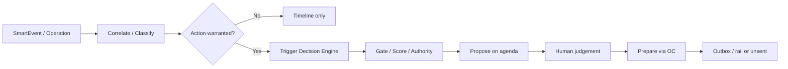

# SPP Operation Center Architecture v1.0

> Official Operation Center architecture specification for the Smart Property Platform (SPP).
> This is a core enterprise architecture document. It defines the real-time operational brain that monitors, coordinates, orchestrates, and supervises operational events across SPP — not how queues or workers are coded.
> Document process and SSOT rules: `docs/ARCHITECTURE_GOVERNANCE.md`. Index: `docs/README.md`.

---

# 0. Document authority and boundaries

## 0.1 Role in the document set

| Document | Owns | This document must |
|---|---|---|
| `docs/SPP_CONSTITUTION.md` | Product identity; Operation Center mandate (§10); AI proposes / humans approve | Obey; never grant silent outbound autonomy |
| `docs/DOMAIN_MODEL.md` | Meaning of `Operation`, `SmartEvent`, `Notification`, related actors | Use entity names; not restate attribute catalogs |
| `docs/SPP_BLUEPRINT.md` | Processing stages, integration ACL, event envelope, pending-action kinds | Link structural rules; not copy stage tables |
| `docs/SYSTEM_ARCHITECTURE.md` | Enterprise placement, event-driven migration, HA/scale framing | Align operational topology and orchestration |
| `docs/DATA_ARCHITECTURE.md` | Event storage, operational data, audit durability, retention | Align persistence; not redefine stores |
| `docs/DECISION_ENGINE.md` | What may be decided, approved, forbidden; scoring; learning | Trigger decisions; never absorb decision authority |
| `docs/OPERATION_CENTER.md` (this document) | Real-time coordination, monitoring, queues, workflows, incidents, escalation, multi-party orchestration | Be the reference for every real-time operation inside SPP |

**Conflict rule:** Precedence follows Architecture Governance §2.2. This document deepens Blueprint §7 and System Architecture §§10–11. It may not weaken prepare-not-send, gate semantics, Smart Import freezes, or Decision Engine authority classes.

## 0.2 Division of labour (normative)

| Capability | Decides | Coordinates | Executes outbound |
|---|---|---|---|
| Decision Engine | Yes — ranked, gated recommendations | No | No (prepare only via approval path) |
| Operation Center | No — may **trigger** Decision Engine | Yes — events, tasks, incidents, rails | Only after approval + enabled rail |
| AI Employee / Koil | Proposes via Decision Engine path | Consumes OC context for desk | Never silently |
| Owner / delegated agent | Approves | May operate within permissions | Authorises preparation/dispatch |

**Decision:** Decision Engine decides; Operation Center coordinates. **Rationale:** Constitution §10–11 separation of operations intake from judgement. **Consequence:** OC must not become a second agenda of ungoverned “auto-fixes.”

## 0.3 Status legend

Aligned with Blueprint: **Implemented** · **Partial** · **Placeholder** · **Planned**.

## 0.4 Decision record format

Every architectural choice below states **Decision**, **Rationale**, and **Consequence**. Gaps are first-class in §37 as **OC-***.

## 0.5 Naming

| Term | Meaning here |
|---|---|
| Operation Center (OC) | Real-time command center for monitoring, coordinating, orchestrating, and supervising operational events |
| Operation | Append-only domain log entry (Domain Model §5.14) |
| SmartEvent | Normalised operational fact from external or internal sources (Domain Model §5.22) |
| Pending action | Owner-resolvable operational item awaiting human judgement |
| Incident | Correlated set of events requiring coordinated response beyond a single task |

Official spelling in product prose: **Operation Center** (Constitution §10). Blueprint “Operations Center” refers to the same capability.

---

# 1. Operation Center Vision

The Operation Center is the **operational brain** of SPP: the place where live property reality is admitted, understood in SPP vocabulary, correlated across sources, supervised through queues and workflows, and handed to humans and the Decision Engine without losing provenance.

It realises Constitution §10: every external event passes through the operation engine before reaching users.

**Decision:** OC is a platform capability, not a dashboard widget. **Rationale:** Chronology and coordination define an operations platform (Domain Model `Operation` responsibility). **Consequence:** Screens are Presentation of OC state; they are not the OC.

**Decision:** OC spans device and service. **Rationale:** Device-first working truth (Blueprint §2.6); pull-based desk today, event bus target tomorrow. **Consequence:** Offline-capable supervision must degrade gracefully without inventing delivery.

---

# 2. Operational Philosophy

| Decision | Rationale | Consequence |
|---|---|---|
| Admit foreign reality only through anti-corruption | Blueprint §2.7, §8 | Vendor payloads never become domain truth raw |
| Coordinate before notify | Constitution §10 | Users see audience-scoped, interpreted outcomes — not raw feeds |
| Human authority for consequential side effects | Constitution §11; Decision Engine §§9–11 | OC queues pending actions; it does not self-dispatch money/messages |
| One timeline, many sources | Domain Model Operations context | Reconstructability beats ephemeral toasts |
| Correlation over noise | Property Employee maturity | Related signals become incidents/workflows, not N unrelated cards |
| Caution under uncertainty | Gate and quality passengers | Ambiguous events escalate to review, not confident automation |

**Philosophy statement:** Operation Center turns **live operational signals** into **supervised, auditable coordination** that keeps owners in control while the AI Employee stays informed.

---

# 3. Operational Principles

| # | Principle | Normative effect |
|---|---|---|
| O1 | Authenticate at the boundary | Fail closed when secrets missing in production |
| O2 | Normalise before interpret | SPP vocabulary only past ACL |
| O3 | Idempotent intake | Source identity dedup; redelivery safe |
| O4 | Audience isolation | Notifications never cross entitlements |
| O5 | One pending action, one resolution | No ambiguous multi-intent controls |
| O6 | Append-only operations log | No silent rewrite of what happened |
| O7 | Prepare ≠ send | Delivery state always distinguishable |
| O8 | Trigger decisions; do not replace them | Hand off judgement to Decision Engine |
| O9 | Correlate by subject | Unit/tenant/contract/property keys drive grouping |
| O10 | Escalate on risk and staleness | Urgency without evidence still cannot invent action |
| O11 | Preserve provenance | Event → operation → decision → preparation chain intact |
| O12 | Degrade, don’t blank | Per-rail failure must not freeze unrelated supervision |

---

# 4. Responsibilities

| Responsibility | In scope | Out of scope |
|---|---|---|
| Monitor | Health of rails, queues, pending ageing, incident load | Owning Executive Report number calculation |
| Receive & admit | Webhooks, pulls, internal operational emits | Smart Import file parsing stages (Blueprint §9) |
| Classify & prioritise | Urgency, type, audience, subject | Replacing consistency gate for import batches |
| Correlate | Multi-event incidents and dependencies | Voting away Decision Engine conflicts |
| Orchestrate workflows | Maintenance, leasing, finance, utility, emergency paths | Silent payment or messaging dispatch |
| Supervise humans & agents | Task distribution, escalation, operator views | Granting AI execution authority |
| Update knowledge/ops memory | Feed operational history into Knowledge Base | Hand-authoring portfolio facts as free text |
| Trigger decisions | Emit candidates / invalidate agendas | Scoring, gating, authority classification (Decision Engine) |
| Audit | Trace intake → resolution | Replacing product audit with infra logs only |

**Decision:** OC owns coordination contracts; Decision Engine owns judgement contracts. **Rationale:** §0.2. **Consequence:** Shared pending-action kinds must remain jointly compatible with Blueprint §7.2 and Decision Engine human-approval rules.

---

# 5. Operational Scope

## 5.1 In scope

- Real-time and near-real-time operational events across portfolio subjects  
- Pending owner/agent actions arising from operations  
- Incident and emergency coordination  
- Domain operational lanes: maintenance, leasing, financial, utility, AI Employee desk enrichment  
- Integration orchestration for admitted and prepared outbound rails  
- Multi-actor tasking: owners, property managers/agents, tenants, technicians, guards  

## 5.2 Explicitly adjacent (not owned)

| Adjacent | Owner document |
|---|---|
| Import analysis stages & apply merge | Blueprint §9; Data Architecture import flow |
| Decision scoring/gate/authority | `docs/DECISION_ENGINE.md` |
| Report truthfulness rules | Blueprint §10 |
| Store planes & retention | `docs/DATA_ARCHITECTURE.md` |

## 5.3 Interaction map (required parties)

| Party / system | OC interaction |
|---|---|
| Google Sheets | Ledger/hybrid reads may refresh operational context; PDF/report generation is requested after applied truth — OC does not treat Sheets as an event bus |
| Smart Import | Apply commits emit operational facts (churn, conflicts); OC must not bypass apply to mutate registry |
| Executive Reports | OC supplies timeline/incident signals projectable into reports; numbers remain engine-owned |
| Knowledge Base | OC appends operational history; reads subject context for correlation |
| Decision Engine | OC triggers generation/invalidation; consumes approval outcomes for workflow progression |
| AI Property Employee | OC enriches desk tasks from events; desk is Presentation of OC + Decision agenda |
| Home Assistant | Planned sensor/telemetry intake via ACL → SmartEvent |
| Green API | Planned outbound messaging rail after approval; today deep-link preparation only |
| Ejar (lease registry) | Inbound notices/expiry → normalised SmartEvents |
| Electricity / Water providers | Inbound bills/notices/readings → utility lane |
| Payment systems | Planned settlement callbacks update delivery state on prepared actions |
| Sensors | Planned IoT signals; demo readings are not production authority |
| Mobile app / Web dashboard | Operator and owner surfaces for queues, timelines, approvals |
| Owners | Primary approvers and supervisors |
| Tenants | Portal-scoped submissions and notifications |
| Technicians | Assigned work desks; never portfolio finance |
| Property managers (agents) | Delegated subset of owner operational authority |

Integration status inventory remains Blueprint §8.2; this table states **OC relationship**, not transport detail.

---

# 6. Real-Time Monitoring

| Monitor surface | Watches | Alert posture (target) |
|---|---|---|
| Rail health | Connected / degraded / disconnected per integration | Owner-visible status; ops alerts on auth failures |
| Intake rate & failures | Rejected webhooks, secret failures, parse failures | Priority to fail-closed defects |
| Queue depth & age | Pending actions, incident queues | Escalation on SLA breach (Planned numeric SLOs) |
| Correlation backlog | Unlinked high-urgency events | Prevent silent orphan criticals |
| Desk freshness | Last successful pull / bus lag | Degraded banner, not false “all clear” |
| Delivery outbox (target) | Prepared-but-unsent / retrying | Never duplicate approval |

**Decision:** Monitoring is product-visible for owners where it affects trust (rail health, pending ageing). **Rationale:** Property Employee transparency. **Consequence:** Hide only credentials and raw vendor payloads — not the existence of failure.

---

# 7. Event Reception Layer

Reception implements Blueprint §7 Intake + §8 ACL pattern.

| Concern | Requirement |
|---|---|
| Channels | Webhooks, client pull, internal domain emits, future bus consumers |
| Auth | Shared secrets / signed calls; fail closed in production |
| Acceptance | Raw payload stored only as evidence reference per retention policy |
| Rejection | Unauthenticated or malformed traffic never enters interpretation |
| Dual engines of truth | Sheets/API hybrid reads are context refresh, not webhook substitutes |

**Decision:** Reception is the only door for foreign operational signals. **Rationale:** Constitution §10. **Consequence:** UI “simulate event” tools in beta must still pass normalisation semantics or be labelled non-production.

Cross-refs: System Architecture §11; Data Architecture event storage.

---

# 8. Event Classification

| Classification axis | Purpose |
|---|---|
| Source family | Lease, utility, messaging, sensor, payment, internal, import-derived |
| Type | Notice, bill, reading, message, threshold breach, state transition, proof submission |
| Subject | Property / building / unit / tenant / contract / ticket / asset |
| Audience | Owner, agent, tenant, technician, guard |
| Urgency seed | Initial priority hint before correlation |
| Actionability | Informational / pending-required / decision-trigger / emergency |

**Decision:** Classification emits SPP vocabulary only. **Rationale:** Anti-corruption. **Consequence:** Vendor type codes remain ACL metadata, not domain enums.

---

# 9. Event Prioritization

| Priority band | Operational meaning | Typical handling |
|---|---|---|
| Critical | Safety, legal immediacy, severe service outage | Emergency lane; human attention now |
| High | Money or occupancy at near-term risk | Fast queue; Decision Engine trigger |
| Medium | Standard operational work | Domain workflow queues |
| Low | Informational enrichment | Timeline + optional desk card |
| Deferred | Snoozed / waiting dependency | Re-enter when due or dependency clears |

**Decision:** Priority expresses attention order inside OC, not execution rights. **Rationale:** Decision Engine §7 same rule for decisions. **Consequence:** Critical + insufficient evidence ⇒ urgent investigate/gather, not invented dispatch (Decision Engine §11 / §24).

---

# 10. Event Correlation

| Correlation key | Groups |
|---|---|
| Subject identity | Same unit/tenant/contract/ticket |
| Time window | Related bursts (e.g. bill + tenant message) |
| Causal chain | Assignment → en route → complete → tenant approval |
| Incident id | Explicit multi-event incident bag |
| Analysis / batch id | Import-derived operational facts |

**Decision:** Correlation creates incidents and workflow context; it does not silently drop events. **Rationale:** Auditability. **Consequence:** Linked events remain individually traceable on the timeline.

**Decision:** Cross-source correlation happens after normalisation. **Rationale:** Cannot safely join vendor shapes. **Consequence:** ACL incompleteness blocks correlation quality — surfaced as OC gap, not guessed joins.

---

# 11. Operational Timeline

The timeline is the owner/operator view of the append-only `Operation` log plus linked SmartEvents.

| Timeline obligation | Statement |
|---|---|
| Chronology | Occurred-at order per subject; global portfolio filter allowed |
| Actors | Owner, tenant, technician, employee, system distinguishable |
| Pending markers | Waiting human resolution clearly flagged |
| Decision links | When an operation triggered or resolved a Decision, link by id |
| Privacy | Audience filters apply when non-owners view |

**Decision:** Timeline is reconstructive truth of coordination, not a chat transcript. **Rationale:** Domain Model `Operation`. **Consequence:** Cosmetic UI regrouping must not edit underlying entries.

---

# 12. Operational Context

Context assembled for correlation, workflows, and Decision triggers:

| Context slice | Source |
|---|---|
| Subject master facts | Registry / leasing / finance working truth |
| Recent events | SmartEvent store for subject |
| Open tickets / contracts | Maintenance & leasing state |
| Quality / gate flags | When import-derived |
| Pending actions | OC queues |
| Decision agenda subset | Open decisions for subject |
| Rail health | Integration status |
| Actor permissions | Owner vs agent vs portal scope |

**Decision:** Context for LLM explanation remains bounded and verified-only. **Rationale:** Blueprint §6.3; Data Architecture privacy. **Consequence:** OC context builders for language must reuse Decision/AI guardrails — no raw uploads.

---

# 13. Operational States

| State (capability-level) | Meaning |
|---|---|
| Listening | Rails authenticated; intake open |
| Degraded | One or more rails unhealthy; others continue |
| Backlogged | Queues/ageing beyond target |
| Incident-active | One or more open incidents |
| Emergency-active | Emergency lane engaged |
| Awaiting human | Pending actions block progression |
| Prepared-unsent | Approvals exist; dispatch rail pending/disabled |
| Quiescent | No open high/critical work |

Event and pending-action micro-states remain owned by Domain Model / Blueprint; this table is OC supervision state.

**Decision:** Degraded never pretends Quiescent. **Rationale:** Trust. **Consequence:** Status surfaces must show rail and backlog honesty.

---

# 14. Operational Queues

| Queue | Contents | Consumer |
|---|---|---|
| Intake / normalisation | Newly admitted payloads | OC pipeline |
| Pending owner/agent actions | Blueprint §7.2 kinds | Owner/agent UI |
| Technician assignments | Work awaiting field actor | Tech portal desk |
| Tenant requests / proofs | Portal submissions needing confirm | Owner/OC finance-maintenance lanes |
| Incident queue | Correlated bags needing command | Operator / owner |
| Escalation queue | Aged or risk-raised items | Escalation policy |
| Outbox (target) | Approved prepared dispatches | Worker + rails |

**Decision:** Queues are coordination structures, not alternate decision agendas. **Rationale:** One Decision agenda (Decision Engine). **Consequence:** Queue cards that recommend action must link or spawn Decision identities when actionable.

---

# 15. Operational Workflows

Workflows are multi-step supervised paths OC advances as events and approvals arrive.

| Workflow property | Requirement |
|---|---|
| Explicit stages | Named, auditable transitions |
| Guards | Cannot skip approval when authority class requires human |
| Compensation | Failure leaves timeline honest; no silent rollback of history |
| Subject binding | Workflow instance tied to entities |
| Idempotency | Re-delivered events do not fork duplicate workflows |

Examples (non-exhaustive): maintenance ticket lifecycle supervision; renewal notice handling; utility bill → prepare pay; tenant payment proof confirmation; portal share after approval.

**Decision:** Workflow engines orchestrate; they do not invent financial totals. **Rationale:** Deterministic money ownership. **Consequence:** Workflows read ledger facts; they do not re-implement arrears math ad hoc in Presentation.

---

# 16. Operational Pipelines

Enterprise pipeline (normative stages owned by Blueprint §7.1):

Intake → Normalisation → Deduplication → Interpretation → Routing → Approval (pending) → Preparation → Logging.

OC architecture adds supervision overlays:

| Overlay | Purpose |
|---|---|
| Classification & prioritisation | §§8–9 |
| Correlation / incident open | §10, §18 |
| Decision trigger | §32 |
| Knowledge update | §31 |
| Escalation | §28 |
| Metrics emit | §34 |

**Decision:** Overlays may not skip ACL or approval semantics. **Rationale:** Trust boundary. **Consequence:** “Fast path” pipelines for emergencies still log and respect forbidden decision classes.

---

# 17. Multi-Event Coordination

| Pattern | Behaviour |
|---|---|
| Merge | Duplicate source identities collapse |
| Bundle | Distinct events share incident/workflow |
| Sequence | Ordered dependencies (e.g. assign before en-route notify) |
| Fan-out | One event → multiple audience notifications |
| Fan-in | Multiple proofs/events → one pending confirmation |
| Suppress-notify | Informational duplicates do not spam; timeline keeps facts |

**Decision:** Coordination prefers subject-ordered processing over global ordering. **Rationale:** Blueprint §12.2. **Consequence:** Cross-subject races must be tolerated; workflows must be idempotent.

---

# 18. Incident Management

An **incident** is a first-class OC construct (target model) grouping correlated events that need command attention.

| Incident field (conceptual) | Purpose |
|---|---|
| Identity | Stable incident id |
| Severity | Maps to priority bands |
| Subjects | Affected entities |
| Linked events/operations | Provenance |
| Commander | Owner or delegated agent |
| Status | Open / mitigating / resolved / cancelled |
| Related decisions | Decision ids spawned |

**Decision:** Incidents coordinate; they do not auto-approve. **Rationale:** §0.2. **Consequence:** Resolving an incident updates timeline; money/messaging still need Decision/approval path.

Status: Partial (correlation exists in lanes; unified incident aggregate Planned — OC-03).

---

# 19. Emergency Operations

| Rule | Statement |
|---|---|
| Lane | Separate emergency queue and monitoring emphasis |
| Authority | Human approval mandatory for external acts |
| Speed | Shorter ageing thresholds; higher ranking |
| Evidence | Insufficient evidence ⇒ investigate tasks, not fabricated actions |
| Audience | Strict scoping; no panic broadcast beyond entitlement |
| Audit | Full trail retained; emergency is not an audit holiday |

Aligns Decision Engine §24. Prepare-not-send remains unless an owner-enabled emergency rail is explicitly governed.

**Decision:** Emergency accelerates attention, not autonomy. **Rationale:** Crisis is when wrong messages hurt most. **Consequence:** OC-06 tracks missing emergency rail policy.

---

# 20. Maintenance Operations

| OC role | Examples |
|---|---|
| Admit | Ticket opens, media uploads, technician status transitions |
| Coordinate | Assignment pending actions; tenant approval waits |
| Enrich | Sensor anomalies (target) into preventive candidates |
| Trigger | Decision Engine maintenance category when action warranted |
| Supervise | SLA ageing, reopen on failed tenant acceptance |

Technicians see assigned work only. Asset memory economics remain Decision/Knowledge concerns when replace-vs-repair is proposed.

---

# 21. Leasing Operations

| OC role | Examples |
|---|---|
| Admit | Ejar notices, expiry warnings, portal tenancy messages |
| Coordinate | Renewal/vacancy pending actions; transfer follow-ups |
| Protect | Official lease assertions stay in platform domain — no blind registry overwrite |
| Trigger | Leasing decisions for renewals and vacancy actions |
| Notify | Audience-scoped owner/tenant notices after approval |

---

# 22. Financial Operations

| OC role | Examples |
|---|---|
| Admit | Payment proofs, ledger-affecting operational confirms, payment-rail callbacks (target) |
| Coordinate | Tenant payment confirmation pending actions |
| Constrain | Collection pushes respect ledger quality / gate (via Decision Engine) |
| Prepare | Payment instructions unsent until rail + approval |
| Never | Invent arrears or mark paid without evidence |

Sheets may supply ledger context under hybrid routing; OC must not treat a sheet edit webhook (if ever added) as bypass of Smart Import apply semantics for portfolio mutation.

---

# 23. Utility Operations

| OC role | Examples |
|---|---|
| Admit | Electricity/water bills, notices, readings |
| Coordinate | Pay-bill preparation; anomaly follow-up; responsibility transfer proposals |
| State | Delivery awaiting payment rail when approved |
| Correlate | Bill + tenant dispute message → incident |

---

# 24. AI Employee Operations

| OC → AI Employee | AI Employee → OC |
|---|---|
| Event enrichment for desk tasks | Owner judgements that resolve pending actions |
| Incident/queue summaries for context builder | Requests to prepare portal shares / follow-ups (still approval-bound) |
| Rail health for degraded explanations | Learning signals do not reconfigure rails silently |

**Decision:** AI Employee is a privileged consumer/producer of OC context, not a parallel intake door. **Rationale:** Constitution §10 single operation engine. **Consequence:** Chat cannot inject vendor-raw events into domain without reception semantics.

---

# 25. Agent Coordination

“Agent” here means **property manager / delegated human** and, in future, **specialist AI agents** under Blueprint §17.

| Rule | Statement |
|---|---|
| Human agents | Operate inside explicit permission subsets |
| AI specialists | Propose via Decision Engine; OC coordinates resulting tasks |
| Coordinator | One owner-facing agenda; OC does not present six competing ops consoles |
| Subject lock (cycle) | One proposer per subject for actions; OC enforces workflow single-commander where required |
| Observability | What each agent did is timeline-visible |

**Decision:** Multi-agent rollout does not fork OC into per-agent event stores. **Rationale:** Shared memory / shared envelope. **Consequence:** Specialists subscribe to unified operational topics (target bus).

---

# 26. Human Operator Interaction

| Operator class | OC surfaces |
|---|---|
| Owner | Full queues, incidents, approvals, rail health |
| Property manager (agent) | Permission-filtered queues and approvals |
| Guard | Building follow-ups only |
| Internal support (future) | Read-only diagnostics without portfolio overreach |

Interaction modes: approve/reject/edit pending actions; assign/reassign; snooze/escalate; acknowledge incidents; request Decision refresh.

**Decision:** Operator actions always append operations. **Rationale:** Reconstructability. **Consequence:** “Clicked away” without log is a defect.

---

# 27. Task Distribution

| Distribution path | From | To |
|---|---|---|
| Owner pending | Interpretation / Decision approval needs | Owner/agent queue |
| Field work | Approved assignment | Technician portal |
| Tenant asks | OC/Decision prepared notices | Tenant portal / messaging rail |
| Guard tasks | Building-scoped follow-ups | Guard portal |
| AI desk tasks | Event enrichment + Decision agenda | Smart Employee desk |

**Decision:** Distribution carries audience-scoped payloads only. **Rationale:** Privacy and Blueprint §15. **Consequence:** Task packets are filtered projections, not whole portfolio dumps.

---

# 28. Escalation Strategy

| Trigger | Escalation behaviour |
|---|---|
| Ageing pending beyond threshold | Raise priority; notify owner/agent |
| Repeated failed correlation | Open incident; data-quality decision trigger |
| Rail disconnected during emergency | Degraded emergency playbook; human alert |
| Decision blocked by gate on critical subject | Review escalation; no execute |
| Technician non-response | Reassignment pending action |
| Tenant non-response to critical notice | Owner escalation path |

**Decision:** Escalation changes attention and routing, not authority class. **Rationale:** Cannot escalate into forbidden auto-pay/auto-message. **Consequence:** Thresholds are policy; expanding auto-effects requires Decision Engine + this document governance.

Numeric thresholds Planned (OC-08).

---

# 29. Notifications Orchestration

| Rule | Statement |
|---|---|
| Derived, not raw | Notifications come from interpreted events/decisions |
| Audience-scoped | One event may fan out differently per audience |
| Preparation | Content composed on approval when outbound |
| Dedup | Suppress spammy duplicates; keep timeline facts |
| Channel | In-app, portal, future Green API/WhatsApp rails |
| Never | Leak finance to technicians/guards |

`Notification` vs `SmartEvent` distinction: Domain Model §5.12.

---

# 30. Integration Orchestration

OC orchestrates integrations as **managed rails**:

| Direction | OC duty |
|---|---|
| Inbound | Auth → ACL → store → classify → correlate → route/trigger |
| Outbound | Only post-approval prepare; dispatch via outbox when rail enabled |
| Config | Owner intent in app; secrets in service environment |
| Health | Status surface + degraded modes |
| Change | New rail must satisfy Blueprint §8.3 admission contract |

Google Sheets remains bidirectional ledger/PDF peer — orchestrated as context and export authority, not as the OC event backbone.

---

# 31. Knowledge Update Flow

| Step | OC behaviour |
|---|---|
| 1 | Persist normalised SmartEvent / Operation |
| 2 | Update subject operational views |
| 3 | Append to Knowledge Base historical/operational memory |
| 4 | Invalidate stale desk enrichment |
| 5 | Preserve provenance edges to event/operation ids |

**Decision:** Knowledge updates from OC are factual operational history, not free-text “AI opinions.” **Rationale:** Data Architecture knowledge rules. **Consequence:** Explanations may narrate history; they do not write invented facts into Knowledge Base.

---

# 32. Decision Trigger Flow

| Rule | Statement |
|---|---|
| Trigger ≠ decide | OC asks Decision Engine to generate/invalidate |
| Authority | Decision Engine classifies automatic/human/forbidden |
| Feedback | Approvals/dismissals return to OC workflows |
| Blocked gate | OC may escalate review; cannot execute |

Cross-ref: `docs/DECISION_ENGINE.md` §§3–11, §18.

---

# 33. Audit & Traceability

Minimum reconstructable chain for consequential operations:

1. Reception auth result and source identity  
2. Normalised event envelope reference  
3. Classification / priority / correlation ids  
4. Operation log entries  
5. Pending action creation and resolution  
6. Linked Decision id and approval record  
7. Prepared content snapshot  
8. Delivery state transitions  
9. Notification fan-out record per audience  

**Decision:** OC audit is product-grade, aligned with Data Architecture §19. **Rationale:** Disputes and learning. **Consequence:** Infra logs alone are insufficient for approval/dispatch forensics.

---

# 34. Operational Metrics

| Metric class | Examples | Use |
|---|---|---|
| Intake | Accept/reject rates, auth failures | Security & reliability |
| Latency | Admit → normalised; pending age | Supervision SLOs (Planned) |
| Queue | Depth by kind/priority | Staffing attention |
| Incident | Open count, MTTA/MTTR (target) | Emergency readiness |
| Rail | Up/degraded/down time | Integration health |
| Decision coupling | Triggers, approvals, blocks | OC↔DE health |
| Notify | Prepared vs sent vs failed | Rail maturity |

**Decision:** Metrics must not include secrets or unnecessary PII. **Rationale:** Privacy classification. **Consequence:** Aggregates preferred for external ops dashboards.

---

# 35. Scalability Strategy

| Dimension | Strategy | Prerequisite |
|---|---|---|
| Event volume | Unified envelope + workers + idempotent consumers | Blueprint §12 migration |
| Subjects | Partition by property/unit keys | Subject-ordered processing |
| Queues | Per-kind queues with shared audit | Durable stores (Data Architecture) |
| Multi-owner | Tenant isolation of operational streams | Authz continuous checks |
| Multi-agent | Shared bus topics; coordinator rules | Decision Engine §17 + Blueprint §17 |
| Fan-out notify | Async outbox | Enabled rails |

**Decision:** Scale coordination without dropping append-only audit or ACL. **Rationale:** Trust > throughput. **Consequence:** Shedding load prefers delaying low-priority informational notifies — never losing approval records.

---

# 36. Future Operational Evolution

| Horizon | Outcome |
|---|---|
| Stabilize | Durable streams; fail-closed secrets; honest rail health |
| Unify | Single intake + envelope; retire per-integration drift |
| Command | First-class incident aggregate; numeric escalation SLOs |
| Automate carefully | Narrow internal automatic effects only under Decision Engine policy |
| Rails | Messaging + payment outbox execution with delivery learning |
| IoT | Home Assistant/sensors as first-class preventive inputs |
| Multi-agent ops | Specialist consumers under one OC + one Decision agenda |

Autonomy growth coordinates work; it does not move approval sovereignty without Constitution-aligned amendments.

---

# 37. Architectural Gaps

| ID | Gap | Impact | Direction | Status |
|---|---|---|---|---|
| OC-01 | No unified event bus / worker tier | Pull-only freshness; weak retries | Blueprint §12 migration; System Architecture §11.4 | Open |
| OC-02 | Per-integration stores still dominant | Correlation and ops metrics fragmented | Unified envelope behind existing surfaces | Open |
| OC-03 | Incident aggregate not first-class | Multi-event command is informal | Model incident in Domain Model + OC §18 | Open |
| OC-04 | Memory-only paths for some streams | History loss on restart | Data Architecture durability (DA-01) | Open |
| OC-05 | Outbound rails absent (Green API, payments) | Coordination stops at prepared content | Owner-enabled rails + outbox | Open |
| OC-06 | Emergency communication policy/rail undefined | Urgency without governed channel | Explicit emergency policy with Decision Engine §24 | Open |
| OC-07 | Home Assistant / sensor production intake absent | Preventive maintenance weak | Device registry + ACL ingestion | Open |
| OC-08 | Numeric escalation / queue SLOs unspecified | Ageing rules informal | Define thresholds with monitoring | Open |
| OC-09 | Operator permission matrix for OC actions incomplete | Agent over/under control risk | Align with Decision Engine DE-09 | Open |
| OC-10 | Cross-lane dependency graph limited | Conflicting order of financial vs maintenance work | Explicit workflow dependencies | Open |
| OC-11 | Payment callback orchestration undefined | Cannot close delivery state from providers | Design under §22/§30 when rail appears | Open |
| OC-12 | Sheets not event-native | Operational freshness depends on pulls/hybrid reads | Keep Sheets as ledger peer; do not force as bus | Accepted |
| OC-13 | Guard/technician task distribution telemetry sparse | Field supervision weak | Portal task metrics without PII excess | Open |

Gaps owned elsewhere (Blueprint §19, SA-*, DA-*, DE-*) are linked, not forked.

---

# 38. How implementers must use this document

1. What `Operation` / `SmartEvent` mean → Domain Model.  
2. Intake stage order, ACL, pending kinds, envelope → Blueprint §§7–8, §12.  
3. Whether something may be decided/auto-acted/forbidden → Decision Engine.  
4. How real-time coordination, queues, incidents, escalation work → **this document**.  
5. Where events are stored/retained → Data Architecture.  
6. Topology / HA / bus migration → System Architecture.  
7. Identity / owner authority → Constitution.  
8. New gap → add **OC-***; do not invent a second decision authority inside OC.

---

# 39. Document status

*Document Status:* Official Operation Center Architecture Specification

*Version:* 1.0

*Class:* Supporting architecture (core Operation Center) under `docs/`

*Project:* Smart Property Platform (SPP)

*Pillars:* `docs/SPP_CONSTITUTION.md`, `docs/DOMAIN_MODEL.md`, `docs/SPP_BLUEPRINT.md`

*Sibling enterprise documents:* `docs/SYSTEM_ARCHITECTURE.md`, `docs/DATA_ARCHITECTURE.md`, `docs/DECISION_ENGINE.md`, `docs/KNOWLEDGE_BASE.md`

*Governance / index:* `docs/ARCHITECTURE_GOVERNANCE.md`, `docs/README.md`

*Change policy:* Division of labour with Decision Engine, reception/ACL overlays, queue and incident coordination rules, escalation boundaries, and OC-* gaps in this document are normative for real-time operations. Gate semantics, Smart Import behaviour, and prepare-not-send remain Blueprint authority. Decision authority classes remain Decision Engine authority. Entity meaning remains Domain Model authority.
