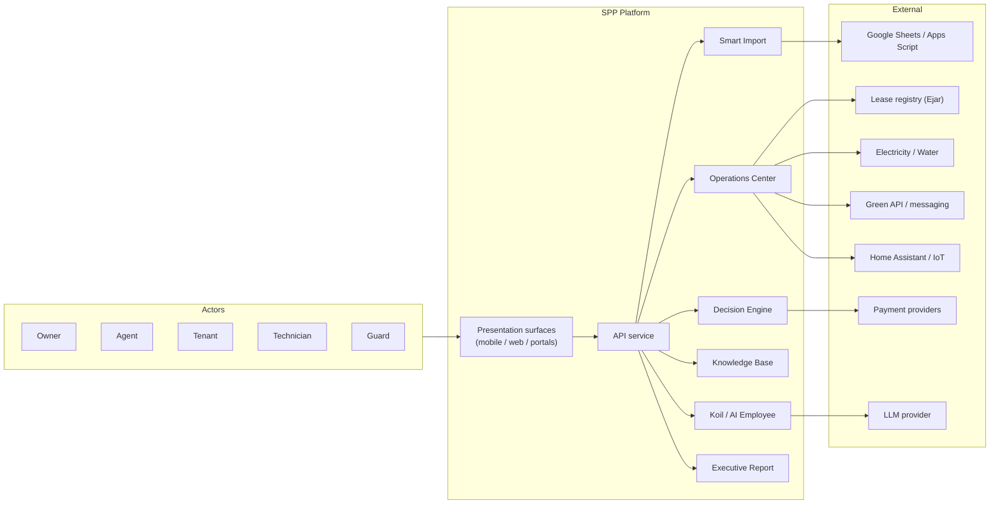
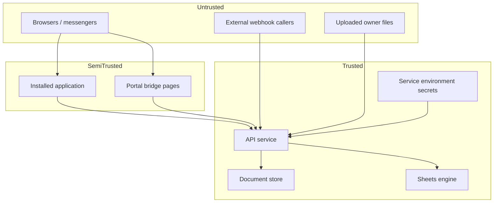
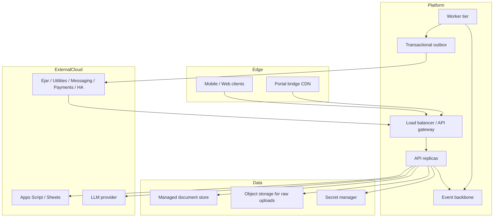

# SPP System Architecture v1.0

> Official end-to-end system architecture specification for the Smart Property Platform (SPP).
> This is a core architecture document. It describes how the complete system is composed, operated, secured, scaled, and evolved — not how individual modules are coded.
> Document process and SSOT rules: `docs/ARCHITECTURE_GOVERNANCE.md`. Index: `docs/README.md`.

---

# 0. Document authority and boundaries

## 0.1 Role in the document set

| Document | Question it answers | Relationship to this document |
|---|---|---|
| `docs/SPP_CONSTITUTION.md` | Why SPP exists; what it must never become | Product law this architecture must obey |
| `docs/DOMAIN_MODEL.md` | What entities mean, how they relate, how they live | Ubiquitous language this architecture uses without redefining |
| `docs/SPP_BLUEPRINT.md` | How layers, pipelines, engines, and integrations are structured | Structural authority for stage tables, gate semantics, and topology details |
| `docs/SPP_ENGINE_VISION.md` | How Koil intelligence layers are separated | Engine philosophy behind the AI Employee |
| `docs/SYSTEM_ARCHITECTURE.md` (this document) | How the complete system hangs together as an enterprise platform | End-to-end composition, operational architecture, and evolution strategy |

This document does **not** replace the three pillars. Where Blueprint owns stage tables, gate semantics, or integration contracts, this document references them. Where Domain Model owns entity meaning, this document uses those names. Where Constitution owns identity, this document enforces it.

## 0.2 Status legend

Aligned with Blueprint: **Implemented** · **Partial** · **Placeholder** · **Planned**.

## 0.3 Normative naming

Per Architecture Governance §6:

| Term | Meaning in this document |
|---|---|
| AI Employee | Product role: proposes, explains, learns; never approves |
| Koil | Intelligence system behind the AI Employee |
| Smart Employee desk | Owner-facing workplace surface of the AI Employee |
| `smart-employee/` | Experimental Arabic SPP Presentation surface — not a second product |

---

# 1. Overall system vision

## 1.1 Enterprise statement

SPP is an **AI-powered Property Operations Platform**. Its architectural centre of gravity is not a screen, a spreadsheet connector, or a chat interface. It is a professional virtual **AI Employee** that:

1. Ingests property truth through protected import and external event rails.
2. Maintains a unified Property Knowledge Base.
3. Analyses operations and proposes ranked decisions with evidence.
4. Prepares owner-approved actions without silent execution.
5. Learns from owner judgement over time.

Constitution §§1–5 define the product identity this architecture realises. Blueprint §2 defines the structural principles. This section states the **system-level outcome**: one coherent operating platform spanning device, service, ledger engines, and external worlds — always with the human owner in control.

## 1.2 System context (enterprise view)

Actors, authority, and external-system status are defined in Blueprint §§3.1–3.2. Runtime containers are defined in Blueprint §4. This diagram is the enterprise composition view only.

## 1.3 Capability map

| Capability | Enterprise purpose | Normative detail |
|---|---|---|
| Smart Import | Turn owner files into portfolio truth | Blueprint §9 |
| Property Knowledge | Hold verified, provenance-bearing facts | Blueprint §11; Domain Model §5+ |
| AI Employee (Koil) | Propose, explain, learn | Blueprint §6; Engine Vision |
| Decision Engine | One ranked agenda with gated confidence | Blueprint §13 |
| Executive Report | Defensible owner narrative and structured report | Blueprint §10 |
| Operations Center | Admit and process every external event | Blueprint §7 |
| Event architecture | Reliable fan-out from intake to consumers | Blueprint §12; this document §11 |
| Integrations | Anti-corruption boundary to foreign systems | Blueprint §8; this document §12 |

## 1.4 Value flow (Constitution data lifecycle)

Constitution §8 defines the lifecycle every dataset follows. At system level, that lifecycle maps to architecture as:

| Lifecycle stage | Primary architectural home |
|---|---|
| Import | Smart Import dual engine |
| Validation / Normalisation | Consistency gate + anti-corruption layers |
| Storage | Device store, document store, Sheets ledger |
| Knowledge | Knowledge Base / Knowledge Graph |
| Analysis | Deterministic engines + Koil reasoning |
| Decision | Decision Engine |
| Execution | Prepare-not-send → approved dispatch rails |
| Learning | Preference and client-profile memory (target) |

---

# 2. Frontend architecture

## 2.1 Role

The frontend is the **Presentation and Application** surface for owners and portal actors. It is not the Decision Engine, not the Knowledge Base authority, and not an integration credential store. Clean Architecture layer rules: Blueprint §5.2; Domain Model §3.2.

## 2.2 Surfaces

| Surface | Audience | Responsibility | Status |
|---|---|---|---|
| Owner application (Expo / React Native / RN Web) | Owner, delegated agent | Portfolio, Smart Employee desk, import preview/apply, reports, settings | Implemented |
| Tenant / technician / guard portals | External parties via HTTPS links | Scoped self-service without installation | Implemented (bridge + tokens) |
| Experimental Arabic surface (`smart-employee/`) | Locale / RTL exploration | Presentation experiment under one Constitution | Experimental (Governance §6.3) |

## 2.3 Architectural responsibilities

| Allowed in Presentation / client Application | Forbidden |
|---|---|
| Render state; capture owner intent | Computing arrears, occupancy eligibility, or money truth |
| On-device portfolio working set and offline usefulness | Treating vendor payloads as domain records |
| Local task ranking enrichment for the desk | Silent outbound dispatch without approval record |
| Fault-tolerant per-call API use | Global session failure on one integration error |
| Persona and navigation scoping | Holding provider connection secrets |

## 2.4 Device-first working truth

Blueprint principle §2.6: the device holds working truth. Enterprise implications:

- Offline usefulness is a first-class architectural requirement, not a convenience.
- Apply merges and store migrations on device are permanent cost centres (Blueprint §18).
- Cloud reconciliation must never require wiping owner-confirmed official records.
- Portal actors do not receive a full device portfolio; they receive audience-scoped views only.

## 2.5 Client-to-service contract

Normative rules live in Blueprint §4.2. Enterprise constraints:

1. API base resolution must never allow shipped builds to depend on a developer machine.
2. Trailing slashes on the base are stripped to prevent double-slash routes.
3. Each call degrades independently; the AI Employee desk remains available in deterministic local mode when the service is unreachable (Blueprint §6.4).

---

# 3. Backend architecture

## 3.1 Role

The API service is the **Interface / Application / Domain / Infrastructure** tier for analysis pipelines, decision composition, integration intake, read models, and controlled interpretation. Layer map: Blueprint §5.3.

## 3.2 Logical subsystems

| Subsystem | Enterprise responsibility | Defers detail to |
|---|---|---|
| Upload / Smart Import orchestration | Dual-engine analysis and apply commit | Blueprint §9 |
| Consistency gate | Authoritative conflict verdict and confidence caps | Blueprint §13.2 |
| Decision unification | One agenda from multiple candidate sources | Blueprint §13 |
| AI Employee context and controlled interpreter | Bounded explanation under validation | Blueprint §6 |
| Operations / integration adapters | Anti-corruption intake and prepare-not-send approvals | Blueprint §§7–8 |
| Executive intelligence read models | Briefings, brain agenda, report assembly inputs | Blueprint §10 |
| Persistence adapters | Document store with in-memory fallback; Sheets client | Blueprint §14 |

## 3.3 Process topology (current)

| Aspect | Current state | Enterprise implication |
|---|---|---|
| Process model | Single web process | No native background worker tier today |
| Persistence | Optional MongoDB; beta/demo may run memory-only | Some event streams lose history on restart |
| Sheets engine | Independent Google Apps Script application | Bidirectional ledger and PDF authority when configured |
| Release | Managed cloud web service from designated branch | See §18 Deployment |

Topology risks and mitigations: Blueprint §4.3. Worker-tier introduction is a hard prerequisite for scheduled work, retries, and multi-consumer event delivery (Blueprint §12.4).

## 3.4 Boundary violations to reject

Inherited from Blueprint §5.4 and Governance §9: routers must not own business rules; engines must not read environment keys directly; read models must never be written back as truth; UI must never decide money or eligibility.

---

# 4. AI Property Employee architecture

## 4.1 Product placement

The AI Employee is the product's centre of gravity (Constitution §§3–7; Blueprint §6). **Koil** is the intelligence system behind that role (Engine Vision; Governance §6). Enterprise architecture treats the AI Employee as a **platform capability**, not a chatbot feature bolted onto screens.

## 4.2 Cooperating parts (system view)

Component responsibilities and runtime placement are normative in Blueprint §6.1. At enterprise level, the AI Employee sits at the intersection of:

| Input plane | Processing plane | Output plane |
|---|---|---|
| Applied imports, live portfolio, integration events | Context build → intent → memory retrieve → task generate/rank → enrich → explain | Ranked agenda, explanations, pending actions, learning signals |

## 4.3 Intelligence layering

Engine Vision defines three balanced layers that this architecture must preserve:

| Layer | May do | Must not do |
|---|---|---|
| Deterministic rules | Money, dates, arrears, contracts, completeness checks | Interpret free-form language as calculation |
| AI understanding | Structure discovery, notes, relationships, patterns | Invent financial totals |
| Learning | Client-specific corrections as profile memory | Explode into global one-off rules |

Controlled interpretation guardrails (Blueprint §6.3) remain mandatory whenever a language model is enabled: no invented numbers, entities, decisions, or claimed execution; gate respect; attributable answers; deterministic fallback.

## 4.4 Availability contract

The AI Employee is **never unavailable** — only less informed. Local deterministic reasoning from on-device portfolio state is the degraded mode. Service or LLM failure must not blank the desk.

## 4.5 Authority contract

AI proposes. Humans approve. Approval is a modeled state with a persisted record. No architectural path may grant the AI Employee execution authority. Multi-agent evolution (§16) increases proposal quality, never execution authority.

---

# 5. Data architecture

## 5.1 Enterprise data domains

| Domain | What it holds | Primary authority | Detail |
|---|---|---|---|
| Property Registry | Properties, buildings, units, owners | Applied import / Sheets / device | Domain Model Property Registry context |
| Leasing | Tenants, contracts | Applied import / lease events | Domain Model Leasing context |
| Finance | Payments, invoices, ledger | Sheets or applied import per routing mode | Domain Model Finance context |
| Maintenance | Tickets, assets, technicians | Application + import | Domain Model Maintenance context |
| Intelligence | Decisions, predictions, knowledge | Engines + approvals | Domain Model Intelligence context |
| Operations | SmartEvents, operations log, notifications | Integration streams | Domain Model Operations Center context |
| Ingestion | ImportJob analysis artifacts | Upload/apply pipeline | Domain Model Ingestion context |

Sources of truth, routing modes, and conflict order: Blueprint §14. Entity meaning: Domain Model. This section states **enterprise data classification** only.

## 5.2 Truth classes

| Class | Definition | Mutation rule |
|---|---|---|
| Official owner-confirmed | Human-marked authoritative facts | Never overwritten by statement re-import |
| Applied import derived | Facts committed from a gated analysis batch | Merge by stable identity; change-logged |
| External platform assertion | Facts from lease/utility/messaging domains | Own domain only; via anti-corruption |
| Machine inference | Engine-derived judgement | Always marked as inference; gated |
| Read model / projection | Disposable view for screens and reports | Never written back as source of truth |

## 5.3 Consistency model

| Concern | Model |
|---|---|
| Import apply | Owner-confirmed merge; identity-stable upsert; append-only financial and audit history |
| Gate | Authoritative verdict persisted with analysis and reapplied at read time |
| Integration events | Idempotent by source identity; at-least-once target delivery |
| Device ↔ cloud | Eventual reconciliation; device remains useful offline |
| Approvals | Append-only; delivery state distinct from preparation state |

## 5.4 Provenance and confidence

Blueprint principle §2.8: every fact carries where it came from and how much it can be trusted. Enterprise consumers (Executive Report, AI Employee, Decision Engine, portals) must propagate — never strip — provenance and gate-capped confidence.

## 5.5 Retention and migration policy

- Device stores: shape-tolerant readers; writers never remove fields older builds need (Blueprint §14.4).
- Sheet and column names: frozen (Constitutional Smart Import protection; Governance §5.8).
- Event envelopes (target): full retention for audit window, then summary retained and raw discarded (Blueprint §12.2).
- Applied analysis state: retained per batch for traceability of every later fact.

---

# 6. Knowledge Base interaction

## 6.1 Role

The Knowledge Base (Knowledge Graph layers in Blueprint §11) is the **shared memory** of the platform. Intelligence reads it; Ingestion and Operations write through governed pipelines; Presentation never mutates it directly as free-form text.

## 6.2 Interaction matrix

| Consumer / producer | Interaction | Constraint |
|---|---|---|
| Smart Import (apply) | Writes canonical portfolio, property knowledge, asset memory inputs | Only after owner confirm; merge semantics |
| Consistency gate | Caps and marks knowledge-backed outputs | Blocked entities cannot drive confident decisions |
| AI Employee | Reads bounded, intent-scoped slices | Never receives raw uploaded files in LLM context |
| Decision Engine | Reads knowledge and decision memory | Gate applies before proposal |
| Executive Report | Reads knowledge and reasoning objects | Numbers from engines, not language layer |
| Operations Center | Appends operation and event history into memory | Anti-corruption first |
| Specialist agents (future) | Shared read; no private truth copies | Blueprint §17.4 |
| Learning layer (target) | Writes client-profile corrections | Not global rules |

## 6.3 Query obligations

The graph must continue to answer the traversals in Blueprint §11.3. Architectural changes that break provenance edges (node → asserting batch/event) are rejected.

## 6.4 Current versus target

Current: per-batch snapshots with asset memory and executive intelligence layered on. Target: longitudinal memory across batches and preference learning so understanding compounds (Blueprint §11.4). Enterprise strategy: introduce longitudinal memory **before** autonomous multi-agent Phase Four (Blueprint §17.5).

---

# 7. Smart Import pipeline

Smart Import is a **protected subsystem**. Behavioural change requires an explicit Smart Import-scoped change and must preserve CSV, Excel, Google Sheets, historical imports, and sheet/column identity stability (Governance §5.8; Blueprint §9 preamble).

## 7.1 Enterprise placement

| Concern | Statement |
|---|---|
| Dual engine | Sheets pipeline preferred when configured; service-side pipeline otherwise; identical contract to the application |
| Owner preview | Nothing persists until explicit apply |
| Gate | Blocking contradictions prevent execution of derived decisions |
| Reporting | Applied batches feed Executive Report and AI analysis — capability must never be reduced |

Stage table, apply semantics, and protections: Blueprint §9. Domain entities for `ImportJob` and related aggregates: Domain Model.

## 7.2 System contracts this pipeline must uphold

1. Imports merge, never replace (Blueprint §2.9).
2. No invented dates, contract numbers, or identifiers absent from source.
3. Analysis identity links upload preview, apply, audit, and AI state.
4. Every difference is change-logged (added / updated / conflicting).
5. Benchmarks prove generic engine maturity — not hardcoding to one owner's files (Engine Vision; Blueprint §16.1).

---

# 8. Executive Report pipeline

Executive reporting is a **core capability** (Constitution §12). No architectural change may reduce Executive Report, AI analysis, Owner Dashboard, or predictive insight capability (Governance §5.9).

## 8.1 Enterprise products

Two products, one source — structured Executive Report and narrative Executive Brief — are defined in Blueprint §10.1. Live read models (morning briefing, executive brain, per-screen verdicts, report cards) must reapply the gate so blocked batches cannot present confident dashboards (Blueprint §10.2).

## 8.2 Truthfulness as architecture

| Rule | Architectural meaning |
|---|---|
| Engines own numbers | Language layer explains; never calculates report totals |
| Gate owns confidence | Blocked → review items, not softened claims |
| Sheets engine owns portable PDF when configured | Service requests generation; one formatting authority |
| Decision identifiers survive rewriting | Every narrative claim remains traceable |

## 8.3 Continuity requirement

Any new data source (integration event, sensor, payment rail) must eventually be projectable into Executive Report and predictive insight paths. Architecture that strands operational data outside reporting is incomplete.

---

# 9. Decision Engine

## 9.1 Enterprise purpose

Produce **one owner agenda**: ranked, evidence-bearing, gate-aware proposals that prepare actions without silent execution. Pipeline stages and gate semantics: Blueprint §13.

## 9.2 System invariants

1. Multiple candidate sources unify into one decision per real-world action.
2. Every decision presented to the owner includes reason, evidence, expected outcome, and risk level (Constitution §11).
3. Approval creates a prepared action with explicit unsent delivery state (prepare-not-send).
4. Learning signals (approve / edit / dismiss / snooze) feed future ranking without granting autonomy.
5. Gate status is entity-aware and reapplied at read time.

## 9.3 Execution boundary

Delivery exists only behind owner-enabled dispatch rails. Utility payments and messaging remain prepared-only until those rails are explicitly introduced under Blueprint change control. This is trust architecture, not a missing feature ticket.

---

# 10. Operations Center

## 10.1 Enterprise purpose

Constitution §10: every external event passes through the operation engine before reaching users. The Operations Center is that engine (Blueprint §7).

## 10.2 Processing contract

Intake → Normalisation → Deduplication → Interpretation → Routing → Approval (pending action) → Preparation → Logging.

Enterprise rules that cannot be weakened:

| Rule | Meaning |
|---|---|
| Fail closed on auth | Missing webhook secrets in production are defects |
| SPP vocabulary only past the boundary | Vendor field names stop at the normaliser |
| Audience scoping | Notifications never leak cross-audience data |
| One owner decision resolves one pending action | No ambiguous multi-button implications |
| Immutable operation log | Reconstructability after the fact |

## 10.3 Current versus target shape

Today: per-integration streams, client pull on desk focus. Target: unified intake and event model behind a shared bus (Blueprint §§7.3, 12). Enterprise migration order is fixed in §11.4 of this document and Blueprint §12.4.

---

# 11. Event-driven architecture

## 11.1 Honest current state

There is no message broker, queue, scheduler, or background worker today (Blueprint §12.1). The system uses pull-based fan-out with dual deduplication (server source identity + device seen set). This is acceptable only while event volume is low and every consequential action requires human approval.

## 11.2 Target enterprise event platform

| Aspect | Target |
|---|---|
| Envelope | Unified shape for all sources (identity, source, type, times, subjects, bilingual summary, priority, audiences, status, raw reference) |
| Topics | Portfolio, financial, maintenance, integration, decision, notification |
| Delivery | At-least-once; consumer idempotency mandatory |
| Ordering | Per subject, not global |
| Outbox | Prepared actions retryable without duplicating approval |
| Observability | Trace from intake → interpretation → approval → dispatch |

Full normative target: Blueprint §12.2–12.3.

## 11.3 Consumers (enterprise)

| Consumer | Reaction to events |
|---|---|
| AI Employee | Raise / refresh tasks |
| Decision Engine | Generate or invalidate candidates |
| Notification service | Audience-routed drafts |
| Knowledge Graph | Accumulate history |
| Operations log | Append what happened |
| Executive read models | Invalidate or refresh projections |

## 11.4 Migration sequence (normative order)

1. Unified envelope behind existing integration surfaces.
2. Move per-integration stores onto the envelope without breaking read APIs.
3. Outbox for prepared actions.
4. Worker tier for retries and scheduled work — only after resolving single-process topology limits.

Skipping ahead to a broker without the envelope and outbox is rejected as architectural debt.

---

# 12. External integrations

## 12.1 Integration landscape

| System | Direction | Enterprise role | Status |
|---|---|---|---|
| Google Sheets via Apps Script | Bidirectional | Owner ledger of record for many owners; import mirror; report PDF | Implemented |
| Lease registry (Ejar) | Inbound | Official contract notices and expiry | Partial (inbound only) |
| Electricity providers | Inbound | Bills, notices, meter readings | Partial |
| Water providers | Inbound | Bills, notices, meter readings | Partial |
| Messaging / intelligence channels | Inbound | Routed messages and analytical signals | Partial |
| Green API / WhatsApp | Outbound (target) | Message delivery rail | Placeholder (client deep links only) |
| Home Assistant / IoT | Inbound (target) | Building and unit telemetry | Placeholder (setup screen only) |
| Payment providers | Outbound (target) | Utility and rent settlement after approval | Absent until owner-enabled |
| Maps | Outbound (target) | Location services | Absent |
| LLM provider | Outbound | Controlled interpretation of verified results | Implemented, disabled by default |
| Future APIs | Either | Must obey the integration contract | Planned |

Transport, authentication, and inventory detail: Blueprint §8. Domain abstractions (`LeasePlatform`, `UtilityAccount`, `Sensor`, `SmartEvent`): Domain Model External Integrations context.

## 12.2 Anti-corruption pattern (enterprise)

Every integration is composed of the same five parts (Blueprint §8.1): vendor client · event normaliser · identity-deduplicating store · application read surface · approval endpoint that prepares, never executes.

## 12.3 Contract for any new or future API

Inherited from Blueprint §8.3 and restated as enterprise admission criteria:

1. Define the SPP-side entity or event first.
2. Authenticate at the boundary; fail closed when secrets are missing.
3. Deduplicate by source identity.
4. Produce bilingual owner-readable summaries at normalisation time.
5. Declare audiences and route accordingly.
6. Prepare responses; require approval before dispatch.
7. Expose connection health (healthy / degraded / disconnected).
8. Preserve Executive Report projectability and Smart Import compatibility.
9. Never place provider credentials in the application binary or device store.

## 12.4 Configuration boundary

Connection secrets live in the service environment. In-app setup screens capture owner intent and local configuration state only. Future self-service connection requires a verification endpoint — local state is never trusted as proof of connectivity.

---

# 13. Security architecture

## 13.1 Security objectives

| Objective | Meaning for SPP |
|---|---|
| Confidentiality | Audience-scoped data; portal tokens; no credential leakage to clients |
| Integrity | Provenance-bearing facts; append-only financial/audit records; gate-aware decisions |
| Availability | Device-first continuity; AI Employee degraded mode; independent call fault tolerance |
| Accountability | Approval records with actor, time, and exact prepared content |
| Non-repudiation of intent | Prepare-not-send separates owner intent from delivery |

Baseline controls: Blueprint §15. This section expands the **enterprise control view**.

## 13.2 Trust boundaries

| Boundary | Control |
|---|---|
| Webhook → API | Shared-secret verification; fail closed in production |
| Upload → analysis | Parse in controlled pipeline; LLM never sees raw files |
| App → API | Public base URL only; no provider secrets in app |
| Portal → API | Opaque revocable tokens; continuous persona checks |
| API → Sheets / LLM / future rails | Server-side credentials only |
| Approval → dispatch | Explicit approval record required |

## 13.3 Identity and access

| Actor | Access model |
|---|---|
| Owner | Full authority; sole approver by default |
| Property agent | Explicit revocable subset of owner permissions |
| Tenant / technician / guard | Opaque portal tokens; audience-scoped views only |
| AI Employee | Read knowledge; write proposals and learning signals; never approve |
| Integration callers | Shared secrets per rail; no user session |

Role scoping is continuous at navigation and API surfaces — not a one-time login check.

## 13.4 Data protection controls

| Control | Requirement |
|---|---|
| Secrets management | Service environment / platform secret store; never committed |
| Context minimisation | LLM context bounded and capped from verified state only |
| Audience isolation | Notification and portal payloads filtered by entitlement |
| Audit trail | Approvals, apply change logs, operation entries reconstructable |
| Webhook misconfiguration | Treat empty expected secrets as production defect |
| Beta / demo isolation | Beta mode forces local deterministic sources; must not leak production secrets |

## 13.5 Threat-oriented safeguards (selected)

| Threat | Architectural safeguard |
|---|---|
| Automated wrong message to tenant | Prepare-not-send; no outbound rail without owner enablement |
| Prompt injection via uploaded notes | Deterministic financial path; validated interpreter; fallback |
| Webhook spoofing | Shared secret; fail closed |
| Cross-tenant portal access | Opaque tokens; audience checks |
| Silent overwrite of owner corrections | Official records outrank imports permanently |
| Credential exfiltration from client | Secrets never shipped to application |

---

# 14. Scalability strategy

## 14.1 Current scale envelope

The platform is designed for correctness and owner trust first. Current topology (single web process, optional document store, client-pull events) supports low-to-moderate event volume and interactive owner workflows. It does **not** yet support high-frequency IoT streams, multi-tenant noisy-neighbour isolation at large fleet scale, or heavy scheduled batch without a worker tier.

## 14.2 Scaling dimensions

| Dimension | Strategy | Prerequisite |
|---|---|---|
| Owner portfolio size | Identity-stable merges; bounded AI context retrieval; device working set | Keep gate and provenance intact |
| Concurrent owners | Stateless API instances behind a load balancer; shared document store | Move critical streams off memory-only |
| Import / analysis load | Asynchronous job execution on worker tier; retain synchronous preview SLA for interactive use | Worker tier + job store |
| Integration event volume | Unified event bus; competing consumers; back-pressure | Blueprint §12 migration |
| Read models | Derived projections; invalidate on events; never use as write truth | Event envelope |
| LLM usage | Disabled by default; bounded context; deterministic fallback under load or failure | Guardrails remain on |
| Sheets engine | Cache lightweight reads; do not put Sheets on the hot path for every screen paint | Hybrid routing modes |

## 14.3 What must not be scaled by shortcuts

- Hardcoding per-owner file shapes (Engine Vision).
- Bypassing the gate to “go faster.”
- Writing vendor payloads into domain stores to avoid normalisation cost.
- Granting AI execution rights to reduce approval latency.

## 14.4 Elasticity target (future)

Horizontal API replicas + dedicated worker pool + managed document store + optional object storage for raw uploads + event backbone. Presentation remains device-capable; cloud elasticity must not become a hard dependency for core owner desk usefulness.

---

# 15. High availability and reliability

## 15.1 Availability goals (architectural)

| Capability | Target behaviour under failure |
|---|---|
| Owner desk / AI Employee | Remains usable via on-device portfolio and deterministic Koil fallback |
| Import preview | Degrades to service-side or Sheets engine per dual-engine contract; never invents success |
| Apply commit | Fail visible; never partial-silent overwrite of official records |
| Integrations | Per-rail degradation; one rail failure does not blank the session |
| Executive Report live views | Gate-capped; never confidently wrong |
| Outbound dispatch (future) | Outbox + retry; approval never duplicated |

## 15.2 Reliability patterns

| Pattern | Application |
|---|---|
| Graceful degradation | Per-call fault tolerance; LLM optional; memory fallback for beta |
| Idempotency | Webhook source identity; future consumer idempotency keys |
| Explicit delivery state | Prepared ≠ sent |
| Authoritative gate | Prefer cautious output over confident wrong output |
| Dual import engine | Sheets and service paths with contract parity |
| Health surfaces | Owner-visible connection status per integration |

## 15.3 Single points of failure (current) and directions

| SPOF / weakness | Direction |
|---|---|
| Single web process | Multi-instance API + worker tier |
| Memory-only event stream | Promote to document store |
| Sheets-only PDF generation | Service-side renderer fallback (Blueprint §19) |
| Branch split for releases | Unify or document promotion path |
| Free-tier cold starts | Paid/always-on tier before SLA-sensitive rails |

---

# 16. Future cloud architecture

## 16.1 Target cloud shape

## 16.2 Cloud principles

1. **Cloud amplifies; device remains capable.** Connectivity enriches; it does not define product usefulness.
2. **Managed data plane before exotic services.** Document store durability and secret management precede multi-region complexity.
3. **Event backbone after envelope.** Do not buy a broker to paper over per-integration drift.
4. **Regional awareness (Planned).** When multi-region appears, subject ordering and approval records must remain correct; active-active for financial truth is not assumed.
5. **Environment separation.** Beta/demo deterministic modes must not share production secrets or production event ingress without isolation.

## 16.3 Adoption phases

| Phase | Cloud capability | Exit criteria |
|---|---|---|
| A | Durable document store for all event streams; fail-closed secrets | No memory-only production streams |
| B | API horizontal scale + health checks + structured logs | Multi-instance safe |
| C | Worker tier + outbox | Retries and scheduled work without dual approval |
| D | Event backbone + specialist agent consumers | Multi-agent Phase Two+ |
| E | Multi-region / DR site | Tested RPO/RTO (§19) |

---

# 17. Multi-agent interaction

## 17.1 Direction

The current AI Employee is one generalist. The target is a small team of specialists under one coordinator — Collection, Leasing, Maintenance, Utilities, Data quality, Reporting — as defined in Blueprint §17.

## 17.2 Enterprise interaction model

| Rule | Statement |
|---|---|
| One owner relationship | Coordinator owns the single agenda; owner never negotiates with six agents |
| Shared memory | All agents read the same Knowledge Base; no private truth forks |
| One proposer per subject per cycle | Avoid conflicting actions on the same real-world subject |
| Conflicts escalate | Disagreement becomes an owner-visible trade-off, not a silent vote |
| Gate is universal | No specialist bypasses blocked data |
| Approval remains human and singular | Autonomy increases proposal quality only |
| Observability | What each agent read and proposed must be reconstructable |

## 17.3 Protocol

Delegation and return proposal fields are normative in Blueprint §17.3. Enterprise requirement: the protocol is versioned as a platform contract before Phase Two specialist boundaries go live.

## 17.4 Rollout coupling

Multi-agent phases are coupled to event and worker maturity (Blueprint §17.5). Architecture forbids advertising continuous autonomous operation before dispatch rails, longitudinal memory, and accuracy tracking exist.

---

# 18. Deployment architecture

## 18.1 Deployable units

| Unit | What ships | Typical trigger |
|---|---|---|
| Frontend JS application | Screens, on-device engines, desk logic | OTA channel on designated branch paths |
| Native application package | Link handling, permissions, package identity | New Android/iOS build |
| API service | Pipelines, integrations, read models | Cloud service deploy from service branch |
| Sheets engine | Ledger/import/PDF Apps Script | Independent script owner deploy |
| Portal bridge | Static HTTPS HTML | Documentation / pages publish |
| Quality gate | Benchmarks and tests | CI on backend/benchmark paths |
| Experimental Arabic surface | Separate Presentation deploy if used | Must not fork domain or engines |

Release matrix detail: Blueprint §16.2.

## 18.2 Environment classes

| Class | Purpose | Data posture |
|---|---|---|
| Local / cloud-agent | Development and verification | Beta mode; seeded or local sources |
| Beta | Owner beta installs and OTA | Controlled; may use hybrid Sheets |
| Production | Live owners | Fail-closed secrets; durable store; no memory-only critical streams |

## 18.3 Compatibility rules

1. OTA runtime version must track application version or updates break on device.
2. API changes must remain backward compatible with installed clients still on prior OTA.
3. Smart Import response shape and apply semantics are a public contract between dual engines and clients.
4. Sheet/column identity freeze remains binding across deploys.
5. Branch split between service and application release trains is a known risk until unified or explicitly documented (Blueprint §4.3, §19).

## 18.4 Quality gates before promotion

Benchmark levels, engine assertions, service tests, and application checks: Blueprint §16.1. Enterprise rule: a fix that only satisfies one owner's files is an engine maturity failure, not a releasable feature.

---

# 19. Monitoring and observability

## 19.1 Observability pillars

| Pillar | What SPP must see |
|---|---|
| Traces | Import analysis_id, decision id, approval id, integration event id across intake → gate → proposal → prepare → dispatch |
| Metrics | Gate status rates, import success/apply counts, webhook auth failures, LLM fallback rate, API latency/errors, worker queue depth (future) |
| Logs | Structured, correlatable by the identities above; no secrets in log bodies |
| Audits | Append-only approvals, operation log, import change log — product audit, not only ops logging |
| Health | Per-integration connection status; service health endpoint; Sheets reachability |

## 19.2 Product-level observability

Operational monitoring is insufficient alone. The platform must also observe:

| Signal | Why |
|---|---|
| Gate block/warning rates by conflict type | Data quality and engine trust |
| Decision accept / edit / dismiss / snooze | Learning and ranking health |
| Prepare-to-dispatch latency (future) | Rail reliability |
| Deterministic vs LLM answer path ratio | Cost and safety |
| Official-record overwrite attempts blocked | Integrity |

## 19.3 Current versus target

| Area | Current | Target |
|---|---|---|
| Service health | Basic health check path | SLOs with alerting |
| Event traceability | Partial per integration | End-to-end envelope tracing (Blueprint §12.2) |
| Client telemetry | Limited | Privacy-preserving desk and sync health |
| Benchmark regression | CI on backend changes | Continuous quality signal tied to release |

## 19.4 Alerting priorities (target)

1. Webhook authentication failures / open-secret misconfiguration.
2. Apply failures after successful preview.
3. Document store unavailability in production.
4. Worker / outbox backlog growth.
5. Abnormal gate block spikes on previously healthy clients.

---

# 20. Disaster recovery

## 20.1 Recovery objectives (architectural targets)

| Tier | Examples | Target posture |
|---|---|---|
| Critical truth | Approvals, applied analysis identity, official owner records, operation log | Durable store; backup; low RPO |
| Reconstructible | Read models, briefings, ranked agenda | Rebuild from truth + engines |
| Ephemeral | In-flight LLM contexts, UI session | Accept loss |
| External ledgers | Owner Google Sheets | Owner-controlled; platform must not be sole copy when Sheets is ledger of record |

Exact numeric RPO/RTO commitments are **Planned** and must be set before production SLA claims. Until then, architecture requires durable persistence for critical truth and rebuild procedures for projections.

## 20.2 Failure scenarios and responses

| Scenario | Response |
|---|---|
| API service loss | Clients continue on device working set; AI Employee local mode |
| Document store loss | Restore from backup; rebuild read models; re-pull integrations with idempotency |
| Sheets engine loss | Fall back to service-side import engine; PDF generation unavailable until restored or service renderer exists |
| LLM provider loss | Deterministic explanation path only |
| Integration rail loss | Mark rail disconnected; quarantine pending inbound; do not block unrelated desk functions |
| Accidental bad apply | Change log + official-record precedence; compensating import; no silent history rewrite |
| Region outage (future) | Fail over per §16 Phase E; approvals must not double-execute (outbox idempotency) |

## 20.3 Backup and restore principles

1. Backups include approvals, applied analysis artifacts, and operation/event stores.
2. Restore drills are part of reliability work, not documentation theatre.
3. Device stores are not a substitute for server backup, but they reduce owner downtime.
4. Raw webhook payloads may be retained only for the audit window, then summarised (Blueprint §12.2).

---

# 21. Architectural constraints

These constraints are binding on all future implementation. Violations require a pillar or governance amendment — not a silent PR.

| ID | Constraint |
|---|---|
| C-01 | SPP identity remains Property Operations Platform / AI Employee — not chatbot, CRM, ERP, or dashboard-only (Constitution §§3–5) |
| C-02 | Business rules never live in UI widgets (Domain Model §2.3; Blueprint §5) |
| C-03 | AI proposes; humans approve; approval is modeled and persisted |
| C-04 | Prepare-not-send for all outbound money and messaging actions |
| C-05 | Smart Import compatibility freeze: CSV, Excel, Sheets, historical imports, sheet/column identities |
| C-06 | Executive Report / AI analysis / Owner Dashboard / predictive insight capability must not be reduced |
| C-07 | Foreign systems cross an anti-corruption boundary before engines see them |
| C-08 | Imports merge by stable identity; official owner corrections permanently outrank statements |
| C-09 | Deterministic and AI layers stay separated (Engine Vision; Blueprint §2.2) |
| C-10 | Device remains useful offline; cloud is not the sole working truth |
| C-11 | Secrets stay in the service environment; applications never hold provider credentials |
| C-12 | `smart-employee/` must not fork Constitution, Domain Model, or engines (Governance §6.3) |
| C-13 | No event bus shortcuts that skip unified envelope, outbox, and worker prerequisites |
| C-14 | Incremental change over rewrites; backward compatibility with installed clients and historical imports |
| C-15 | Implementation of new capability waits for approved architectural baseline coverage (Governance §7) |

---

# 22. Architectural principles

## 22.1 Inherited principles

Constitution §§4–7 and Blueprint §2 are normative. This document adds enterprise phrasing without replacing them.

## 22.2 Enterprise principles

| Principle | Statement |
|---|---|
| Trust before automation | Speed that destroys owner trust is architectural failure |
| One agenda | Many engines, one owner-facing decision list |
| Evidence or silence | Recommendations without reason and evidence are invalid |
| Gate over optimism | Cautious correct output beats confident wrong output |
| Provenance travels | Facts without origin are incomplete |
| Degrade, don't die | Partial intelligence is preferred to hard downtime |
| Contract parity | Dual engines and dual surfaces must keep observable contracts aligned |
| Extensibility without identity fork | Multi-agent and new rails extend one product law |
| Observability is a feature | If it cannot be reconstructed, it cannot be trusted in production |
| Gaps are first-class | Undesigned areas are recorded, not papered over |

---

# 23. Known gaps and future evolution

## 23.1 Gaps owned by Blueprint §19

Track only there; do not fork: event bus/worker tier; outbound rails; telemetry ingestion; placeholder connection screens; optional webhook secrets; memory-only streams; release branch split; Sheets-dependent document generation; longitudinal memory.

## 23.2 Gaps owned by Architecture Governance §8

Track G-04 (operating-path status reconciliation) and any newly discovered document conflicts under governance process.

## 23.3 Enterprise gaps introduced or deepened by this document

| ID | Gap | Impact | Direction | Status |
|---|---|---|---|---|
| SA-01 | No formal SLO / error-budget policy | Availability claims are informal | Define SLOs after durable store and multi-instance API | Open |
| SA-02 | No tested DR runbook with numeric RPO/RTO | Production disaster response unproven | Backup policy + restore drills before SLA marketing | Open |
| SA-03 | Observability incomplete for end-to-end event traces | Hard to audit intake → dispatch | Unified envelope tracing + correlation ids | Open — depends on Blueprint §12 |
| SA-04 | Worker tier absent | Blocks scheduled work, retries, multi-agent Phase Three | Introduce after envelope + outbox | Open |
| SA-05 | Payment and messaging dispatch rails absent | Approvals stop at prepared content | Owner-enabled rails under Blueprint change control | Open |
| SA-06 | Multi-region / active-passive DR not designed | Regional outage strategy undefined | Design in cloud Phase E; avoid double dispatch | Open |
| SA-07 | Client privacy-preserving telemetry sparse | Desk and sync health weakly visible | Minimal telemetry with audience and PII controls | Open |
| SA-08 | Service-side report renderer absent | PDF depends on Sheets engine | Fallback renderer without reducing report quality | Open — listed in Blueprint §19 |

## 23.4 Evolution roadmap (system level)

| Horizon | Outcome |
|---|---|---|
| Stabilize | Close production safety gaps: fail-closed secrets, durable event streams, release-train clarity |
| Operate | Worker tier, outbox, unified event envelope, observability baselines |
| Expand rails | Messaging and payment dispatch behind owner policy; Home Assistant / IoT ingestion |
| Compound intelligence | Longitudinal memory, learning layer, specialist agents under coordinator |
| Cloud maturity | Horizontal scale, SLOs, DR drills, optional multi-region |

Every horizon item must preserve C-01 through C-15.

---

# 24. How implementers must use this document

1. Identity or “what SPP is” dispute → Constitution.
2. Entity or language dispute → Domain Model.
3. Pipeline stage, gate, or integration contract dispute → Blueprint.
4. Koil layer placement dispute → Engine Vision.
5. End-to-end composition, security, scale, HA, DR, deployment, observability, or evolution dispute → **this document**.
6. Document process or naming dispute → Architecture Governance.
7. Discovered contradiction → record as a gap; propose resolution; do not silently pick a side.

Implementation may proceed only when the relevant architectural baseline for the capability is complete and approved (Governance §7).

---

# 25. Document status

*Document Status:* Official System Architecture Specification

*Version:* 1.0

*Class:* Supporting architecture (enterprise end-to-end) under `docs/`

*Project:* Smart Property Platform (SPP)

*Pillars:* `docs/SPP_CONSTITUTION.md`, `docs/DOMAIN_MODEL.md`, `docs/SPP_BLUEPRINT.md`

*Related:* `docs/SPP_ENGINE_VISION.md`, `docs/ARCHITECTURE_GOVERNANCE.md`, `docs/README.md`

*Change policy:* Enterprise composition, security control view, scalability/HA/DR/monitoring strategy, and constraints in this document are normative for system-level decisions. Moving a responsibility across a Clean Architecture boundary, changing gate semantics, Smart Import behaviour, or prepare-not-send still requires the owning pillar revision. Adding this document to the index is mandatory when version meaning changes.
